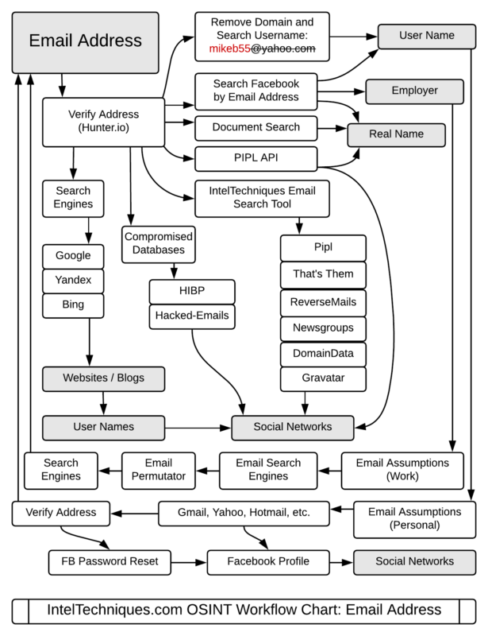

# TraceLabs Guide - Hacktoria

- [TraceLabs Guide - Hacktoria](#tracelabs-guide---hacktoria)
  - [Points](#points)
  - [Missing persons](#missing-persons)
  - [Colections](#colections)
    - [Face of the MP](#face-of-the-mp)
    - [Main social Networks in the USA](#main-social-networks-in-the-usa)
    - [Phone Number Reverse search](#phone-number-reverse-search)
    - [Username Reverse Search](#username-reverse-search)
    - [U.S Registration plates search](#us-registration-plates-search)
    - [People Search](#people-search)
    - [For login patterns and search person link](#for-login-patterns-and-search-person-link)
    - [Also we must not forget to pivot on an email by using](#also-we-must-not-forget-to-pivot-on-an-email-by-using)
    - [And then to also search on by name, email address, password, ip address, or username on](#and-then-to-also-search-on-by-name-email-address-password-ip-address-or-username-on)
    - [Court Documents and arrests](#court-documents-and-arrests)

---

## Points

---

## Missing persons

- Trace Labs org. uses NAMUS to select Missing Persons: <https://www.namus.gov/dashboard>
- <https://www.missingpeople.org.uk/>

---

## Colections

- <https://github.com/cipher387/osint_stuff_tool_collection>

- <https://start.me/p/DPYPMz/the-ultimate-osint-collection>

- <https://github.com/jivoi/awesome-osint>

- <https://inteltechniques.com/tools/index.html>

- <https://start.me/p/Pwy0X4/osint-inception>

---

### Face of the MP

- Run a facial recognition search with PimEyes (https://pimeyes.com/en) , if someone on the team does not have a paid account, just drop the photo on the Team discord channel and ask for a search.

---

### Main social Networks in the USA

- Facebook
- Twitter
- Tiktok
- Instagram
- LinkedIn
- Snapchat
- Reddit
- YouTube

    a.    1/If the MP is hiding on purpose, you may find information on the social accounts of friends or family, or you could find a hidden account of the MP using another name. 
    b.    Don’t forget to grab the Facebook ID and to submit it, this can help if the MP changes names on Facebook.
    c.    You can also pivot from the FB ID to see if the MP is selling stuff on FB Marketplace
    d.    A snapchat account can be found by adding the MP’s phone number to your contacts and then doing a contact search on your Snapchat account
    e.    LinkedIn, don’t forget to use both rocketreach and contactout to try and find the email of the MP and/or phone number
    f.    OSINTGram is good to gather information about an instagram account
    g.    Even if the instagram account is private, you can see underneath a few accounts connected to the MP, maybe by pivoting through them, this can reveal posts about the MP or photos, or comments

---

### Phone Number Reverse search

- Add the number to your contacts on your phone and check if the MP has a Telegram, Signal or WhatsApp account, Snapchat reverse contact finder
- Use the python tool ignorant to check what accounts are linked to the phone number, and FireFly.
- <https://numlooker.com/>
- <https://www.numlookup.com/>
- <https://www.truecaller.com/>
- <https://sync.me/>

---

### Username Reverse Search

- <https://whatsmyname.app/>
- <https://checkusernames.com/>

---

### U.S Registration plates search

- <https://www.vinfreecheck.com/free-license-plate-lookup>
- <https://recordsfinder.com/plate/>

---

### People Search

- <https://thatsthem.com/>
- <https://www.beenverified.com/>
- <https://www.melissa.com/v2/lookups/addresscheck/address/> (this one is very good to search by address, can get a lot of information on the MP)
- <https://www.truthfinder.com/>

---

### For login patterns and search person link

- https://seintpl.github.io/NAMINT/

---

### Also we must not forget to pivot on an email by using

- <https://identificator.space/search>
- <https://epieos.com/>

---

### And then to also search on by name, email address, password, ip address, or username on

- <https://www.dehashed.com/>
- <https://snusbase.com/login>

---

### Court Documents and arrests

- <https://scholar.google.com/schhp?hl=en&as_sdt=2006>
- <https://www.nsopw.gov/>
- <https://arrests.org/>
- <https://publicrecords.searchsystems.net/>
- <https://www.adl.org/hate-symbols>
- <https://inmatesplus.com/>
- <https://www.bop.gov/inmateloc/>
- <http://www.criminalwatchdog.com/neighborhood-watch/>

---

