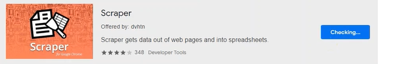
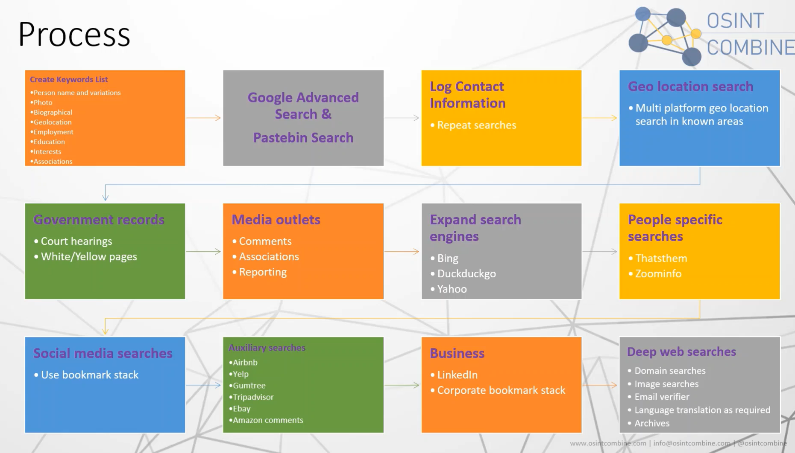
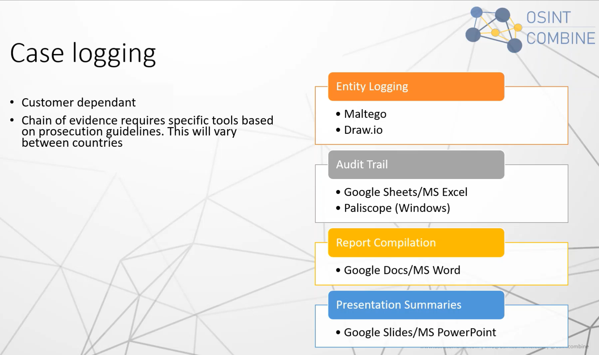
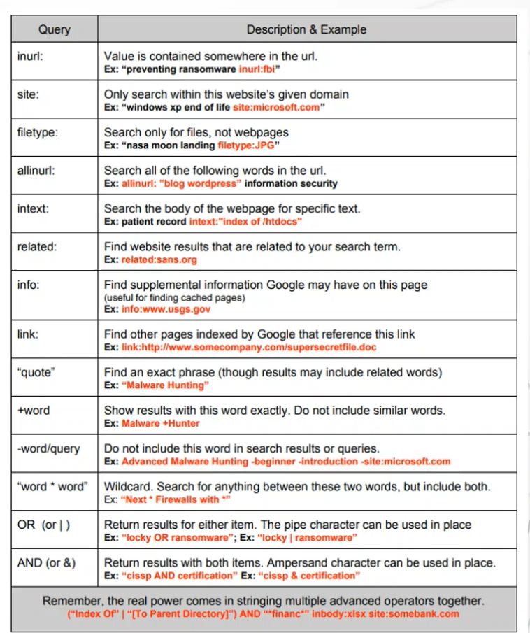
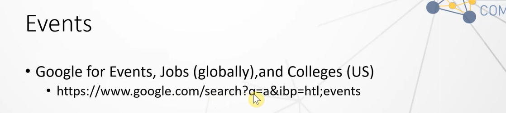
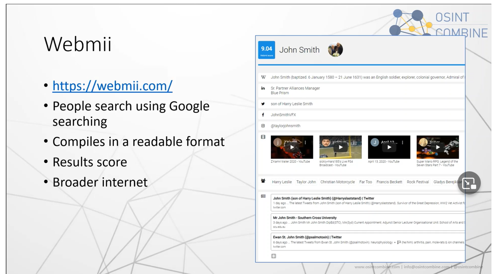
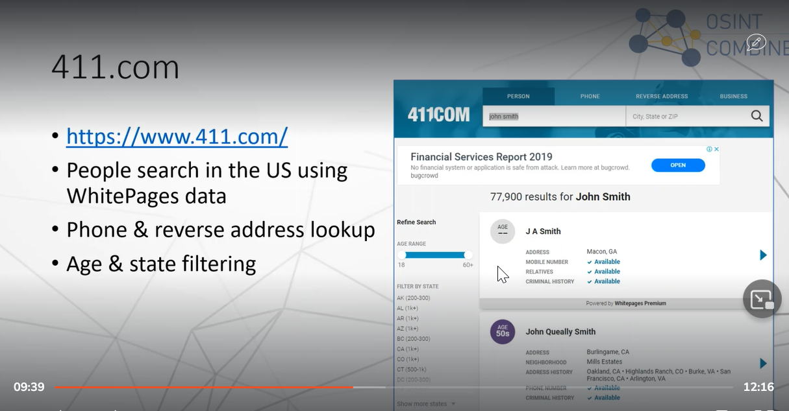
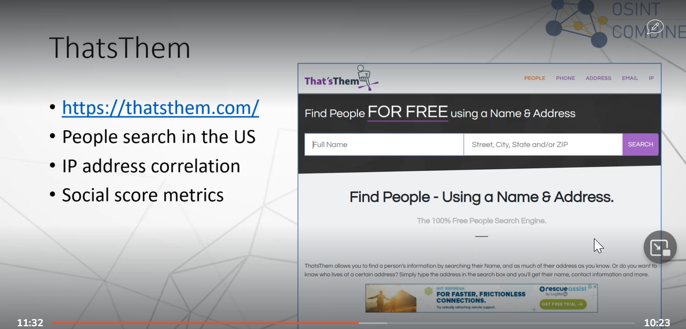
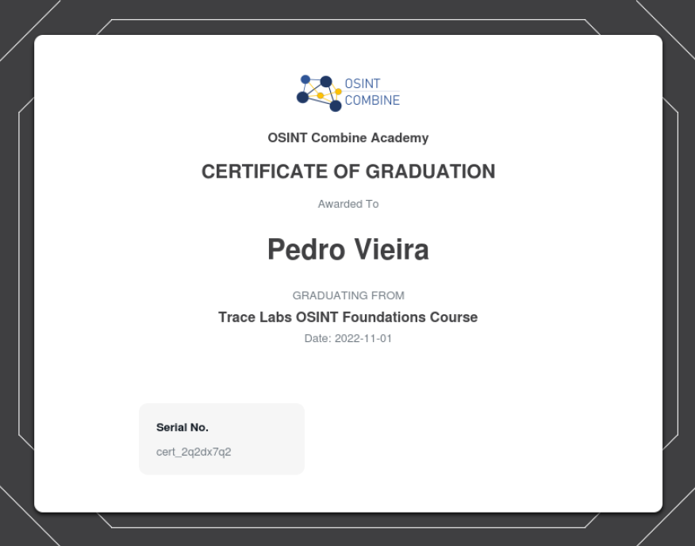

# Trace Labs OSINT Foundations Course

- [Trace Labs OSINT Foundations Course](#trace-labs-osint-foundations-course)

## Open Source Intelligence Fundamentals

### Analysis Techniques (20:36 )

---

### The OSINT Platform (32:23 )

---

### Collection Sources (26:32 )

---

### Collection Approach & Reporting Methods (22:03 )

---

## Information Searching Essentials
     
### Advanced Google Searching (34:12 )

---

### People Search Engines (21:55 )

---

### Username Correlation (17:28 )

---

### Reverse Image Searching (22:02 )

---

## Social Network Analysis
     
### Cross-Platform Social Media Network Analysis (36:08 )

---

Download the custom Linux virtual machine here:

https://drive.google.com/file/d/16T-3_PnNbsXV-IBe5EpT2EVGfkOJWXDD/view?usp=sharing

