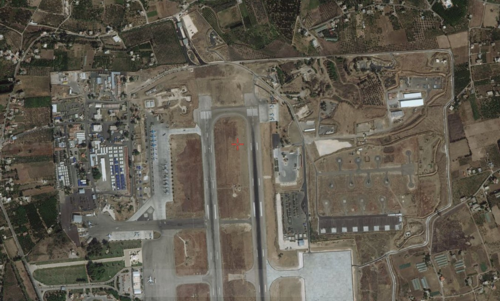
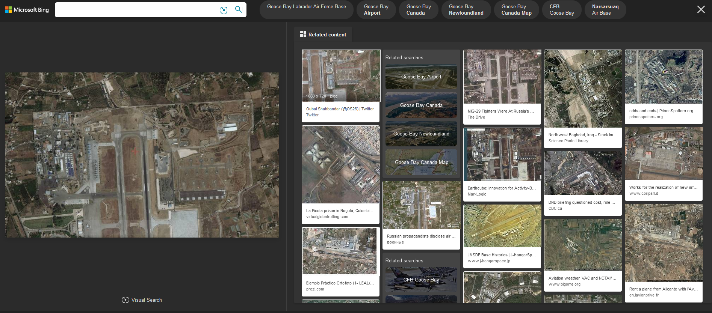
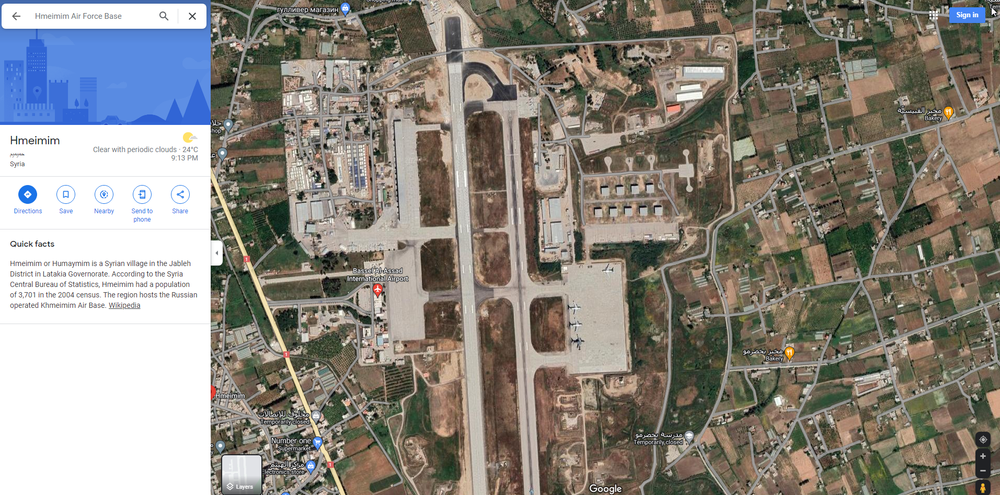
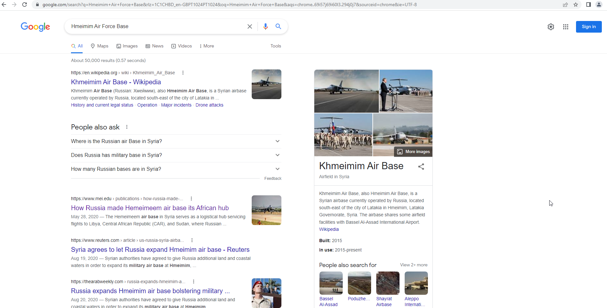
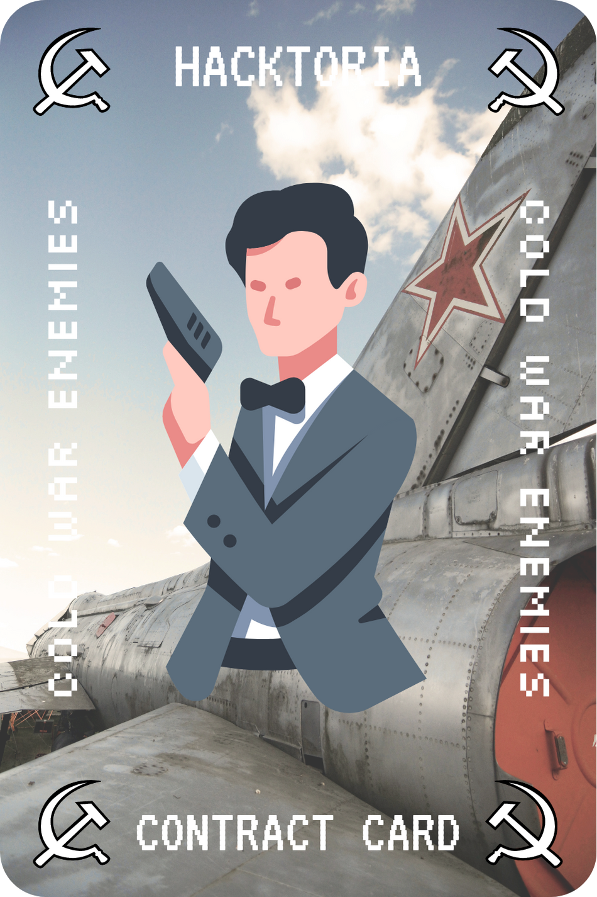

# Hacktoria - Cold War Enemies

# Hacktoria

Greetings Special Agent K. Perhaps you remember our old friend Maksim Kotova? After his capture in Panama he was more than willing to cooporate for reduced sentences.

Following up on the leads he’s given us until this point has resulted in the arrest of several high ranking officials and members of various underground organizations. One of his more promising leads, is a military parts smuggling operation organized by one of Maksim’s former Cold War friends, Vasili Semenov.

Semenov is quietly making a fortune selling Russian military spare parts for scraps to the highest bidder. A lot of these parts aren’t even spares in the literal sense of the word. These parts are all brought together through various air bases around Russia and the world, then routed to a central air base. Where they’re exchanged for cash.

Given the current sticky situation around Russian activity. Not to mention the limited jurisdiction of our client. You are tasked with finding the air base where these sales take place.

The old man wasn’t very much into modern technology, so all we have for you is a sattilite image of the air base. Other items found, are sent to a forensics lab by our client.

Finding the Air Base will lead you to the password for unlocking your link-file.

Password format sample, no caps:

country-governate-district-airbasename-air-base

https://hacktoria.com/contracts/cold-war-enemies/

---

https://gijn.org/resources-for-finding-and-using-satellite-images/

Searched on BING

https://www.sohu.com/a/345284328_352347

 Syria's Khmeimim Air Force Base

Password format sample, no caps:

country-governate-district-airbasename-air-base

syria-latakia-jableh-khmeimim-air-base

https://bit.ly/3DAZZNB

