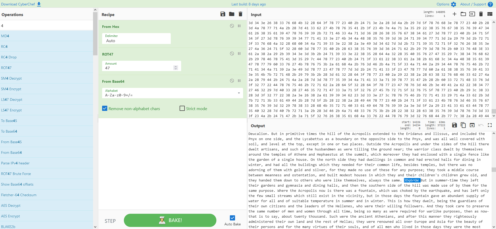
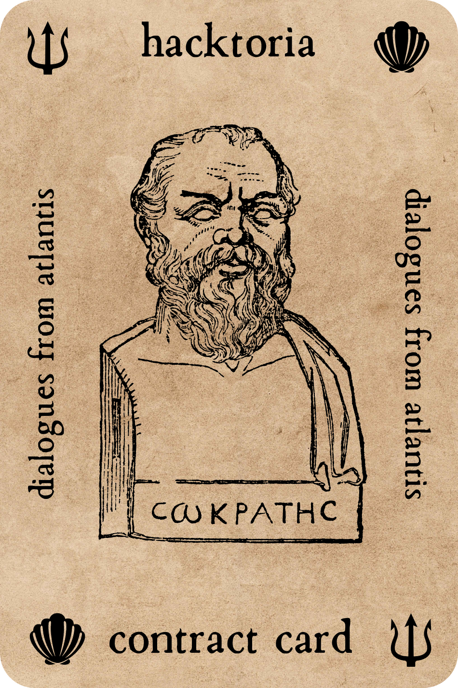

# Hacktoria - Dialogues from Atlantis

# Hacktoria

Greetings, Special Agent K. One of our clients, a wealthy art collector from Monaco, is requesting we help her find a recorded dialogue between Critias, Hermocrates, Timaeus and Soscrates.

In her quest to unravel the mysteries regarding the ancient city of Atlantis, our client wishes to gather all evidence possible as to where the location of the lost city truly is. Getting stuck a fair bit into her endeavors, she has reached out to Hacktoria to decipher a piece of text.

Our client believes this text to be of vital importance to prove the existence of Atlantis as a city. Whether it will lead directly to the discovery of the city is doubtful. Nonetheless, it’s of great importance to unravel it’s meaning.

I trust your ability to deal with ciphers and ancient dialogues in this matter. You find the text below. In the end, this will lead to another Contract Card if you manage to complete this assignment.

As always. Special Agent K, the contract is yours, if you choose to accept.

---

https://hacktoria.com/contracts/dialogues-from-atlantis/

---

Pasting a smaller text into cyberchef and experimenting with the Magic option I was able to find "recipe"

---

Timaeus. How thankful I am, Socrates, that I have arrived at last, and, like a weary traveller after a long journey, may be at rest! And I pray the being who always was of old, and has now been by me revealed, to grant that my words may endure in so far as they have been spoken truly and acceptably to him; but if unintentionally I have said anything wrong, I pray that he will impose upon me a just retribution, and the just retribution of him who errs is that he should be set right. Wishing, then, to speak truly in future concerning the generation of the gods, I pray him to give me knowledge, which of all medicines is the most perfect and best. And now having offered my prayer I deliver up the argument to Critias, who is to speak next according to our agreement.  Critias. And I, Timaeus, accept the trust, and as you at first said that you were going to speak of high matters, and begged that some forbearance might be shown to you, I too ask the same or greater forbearance for what I am about to say. And although I very well know that my request may appear to be somewhat and discourteous, I must make it nevertheless. For will any man of sense deny that you have spoken well? I can only attempt to show that I ought to have more indulgence than you, because my theme is more difficult; and I shall argue that to seem to speak well of the gods to men is far easier than to speak well of men to men: for the inexperience and utter ignorance of his hearers about any subject is a great assistance to him who has to speak of it, and we know how ignorant we are concerning the gods. But I should like to make my meaning clearer, if Timaeus, you will follow me. All that is said by any of us can only be imitation and representation. For if we consider the likenesses which painters make of bodies divine and heavenly, and the different degrees of gratification with which the eye of the spectator receives them, we shall see that we are satisfied with the artist who is able in any degree to imitate the earth and its mountains, and the rivers, and the woods, and the universe, and the things that are and move therein, and further, that knowing nothing precise about such matters, we do not examine or analyze the painting; all that is required is a sort of indistinct and deceptive mode of shadowing them forth. But when a person endeavours to paint the human form we are quick at finding out defects, and our familiar knowledge makes us severe judges of any one who does not render every point of similarity. And we may observe the same thing to happen in discourse; we are satisfied with a picture of divine and heavenly things which has very little likeness to them; but we are more precise in our criticism of mortal and human things. Wherefore if at the moment of speaking I cannot suitably express my meaning, you must excuse me, considering that to form approved likenesses of human things is the reverse of easy. This is what I want to suggest to you, and at the same time to beg, Socrates, that I may have not less, but more indulgence conceded to me in what I am about to say. Which favour, if I am right in asking, I hope that you will be ready to grant.  Socrates. Certainly, Critias, we will grant your request, and we will grant the same by anticipation to Hermocrates, as well as to you and Timaeus; for I have no doubt that when his turn comes a little while hence, he will make the same request which you have made. In order, then, that he may provide himself with a fresh beginning, and not be compelled to say the same things over again, let him understand that the indulgence is already extended by anticipation to him. And now, friend Critias, I will announce to you the judgment of the theatre. They are of opinion that the last performer was wonderfully successful, and that you will need a great deal of indulgence before you will be able to take his place.  Hermocrates. The warning, Socrates, which you have addressed to him, I must also take to myself. But remember, Critias, that faint heart never yet raised a trophy; and therefore you must go and attack the argument like a man. First invoke Apollo and the Muses, and then let us hear you sound the praises and show forth the virtues of your ancient citizens.  Crit. Friend Hermocrates, you, who are stationed last and have another in front of you, have not lost heart as yet; the gravity of the situation will soon be revealed to you; meanwhile I accept your exhortations and encouragements. But besides the gods and goddesses whom you have mentioned, I would specially invoke Mnemosyne; for all the important part of my discourse is dependent on her favour, and if I can recollect and recite enough of what was said by the priests and brought hither by Solon, I doubt not that I shall satisfy the requirements of this theatre. And now, making no more excuses, I will proceed.  Let me begin by observing first of all, that nine thousand was the sum of years which had elapsed since the war which was said to have taken place between those who dwelt outside the Pillars of Heracles and all who dwelt within them; this war I am going to describe. Of the combatants on the one side, the city of Athens was reported to have been the leader and to have fought out the war; the combatants on the other side were commanded by the kings of Atlantis, which, as was saying, was an island greater in extent than Libya and Asia, and when afterwards sunk by an earthquake, became an impassable barrier of mud to voyagers sailing from hence to any part of the ocean. The progress of the history will unfold the various nations of barbarians and families of Hellenes which then existed, as they successively appear on the scene; but I must describe first of all Athenians of that day, and their enemies who fought with them, and then the respective powers and governments of the two kingdoms. Let us give the precedence to Athens.  In the days of old the gods had the whole earth distributed among them by allotment. There was no quarrelling; for you cannot rightly suppose that the gods did not know what was proper for each of them to have, or, knowing this, that they would seek to procure for themselves by contention that which more properly belonged to others. They all of them by just apportionment obtained what they wanted, and peopled their own districts; and when they had peopled them they tended us, their nurselings and possessions, as shepherds tend their flocks, excepting only that they did not use blows or bodily force, as shepherds do, but governed us like pilots from the stern of the vessel, which is an easy way of guiding animals, holding our souls by the rudder of persuasion according to their own pleasure;-thus did they guide all mortal creatures. Now different gods had their allotments in different places which they set in order. Hephaestus and Athene, who were brother and sister, and sprang from the same father, having a common nature, and being united also in the love of philosophy and art, both obtained as their common portion this land, which was naturally adapted for wisdom and virtue; and there they implanted brave children of the soil, and put into their minds the order of government; their names are preserved, but their actions have disappeared by reason of the destruction of those who received the tradition, and the lapse of ages. For when there were any survivors, as I have already said, they were men who dwelt in the mountains; and they were ignorant of the art of writing, and had heard only the names of the chiefs of the land, but very little about their actions. The names they were willing enough to give to their children; but the virtues and the laws of their predecessors, they knew only by obscure traditions; and as they themselves and their children lacked for many generations the necessaries of life, they directed their attention to the supply of their wants, and of them they conversed, to the neglect of events that had happened in times long past; for mythology and the enquiry into antiquity are first introduced into cities when they begin to have leisure, and when they see that the necessaries of life have already been provided, but not before. And this is reason why the names of the ancients have been preserved to us and not their actions. This I infer because Solon said that the priests in their narrative of that war mentioned most of the names which are recorded prior to the time of Theseus, such as Cecrops, and Erechtheus, and Erichthonius, and Erysichthon, and the names of the women in like manner. Moreover, since military pursuits were then common to men and women, the men of those days in accordance with the custom of the time set up a figure and image of the goddess in full armour, to be a testimony that all animals which associate together, male as well as female, may, if they please, practise in common the virtue which belongs to them without distinction of sex.  Now the country was inhabited in those days by various classes of citizens;-there were artisans, and there were husbandmen, and there was also a warrior class originally set apart by divine men. The latter dwelt by themselves, and had all things suitable for nurture and education; neither had any of them anything of their own, but they regarded all that they had as common property; nor did they claim to receive of the other citizens anything more than their necessary food. And they practised all the pursuits which we yesterday described as those of our imaginary guardians. Concerning the country the Egyptian priests said what is not only probable but manifestly true, that the boundaries were in those days fixed by the Isthmus, and that in the direction of the continent they extended as far as the heights of Cithaeron and Parnes; the boundary line came down in the direction of the sea, having the district of Oropus on the right, and with the river Asopus as the limit on the left. The land was the best in the world, and was therefore able in those days to support a vast army, raised from the surrounding people. Even the remnant of Attica which now exists may compare with any region in the world for the variety and excellence of its fruits and the suitableness of its pastures to every sort of animal, which proves what I am saying; but in those days the country was fair as now and yielded far more abundant produce. How shall I establish my words? and what part of it can be truly called a remnant of the land that then was? The whole country is only a long promontory extending far into the sea away from the rest of the continent, while the surrounding basin of the sea is everywhere deep in the neighbourhood of the shore. Many great deluges have taken place during the nine thousand years, for that is the number of years which have elapsed since the time of which I am speaking; and during all this time and through so many changes, there has never been any considerable accumulation of the soil coming down from the mountains, as in other places, but the earth has fallen away all round and sunk out of sight. The consequence is, that in comparison of what then was, there are remaining only the bones of the wasted body, as they may be called, as in the case of small islands, all the richer and softer parts of the soil having fallen away, and the mere skeleton of the land being left. But in the primitive state of the country, its mountains were high hills covered with soil, and the plains, as they are termed by us, of Phelleus were full of rich earth, and there was abundance of wood in the mountains. Of this last the traces still remain, for although some of the mountains now only afford sustenance to bees, not so very long ago there were still to be seen roofs of timber cut from trees growing there, which were of a size sufficient to cover the largest houses; and there were many other high trees, cultivated by man and bearing abundance of food for cattle. Moreover, the land reaped the benefit of the annual rainfall, not as now losing the water which flows off the bare earth into the sea, but, having an abundant supply in all places, and receiving it into herself and treasuring it up in the close clay soil, it let off into the hollows the streams which it absorbed from the heights, providing everywhere abundant fountains and rivers, of which there may still be observed sacred memorials in places where fountains once existed; and this proves the truth of what I am saying.  Such was the natural state of the country, which was cultivated, as we may well believe, by true husbandmen, who made husbandry their business, and were lovers of honour, and of a noble nature, and had a soil the best in the world, and abundance of water, and in the heaven above an excellently attempered climate. Now the city in those days was arranged on this wise. In the first place the Acropolis was not as now. For the fact is that a single night of excessive rain washed away the earth and laid bare the rock; at the same time there were earthquakes, and then occurred the extraordinary inundation, which was the third before the great destruction of Deucalion. But in primitive times the hill of the Acropolis extended to the Eridanus and Ilissus, and included the Pnyx on one side, and the Lycabettus as a boundary on the opposite side to the Pnyx, and was all well covered with soil, and level at the top, except in one or two places. Outside the Acropolis and under the sides of the hill there dwelt artisans, and such of the husbandmen as were tilling the ground near; the warrior class dwelt by themselves around the temples of Athene and Hephaestus at the summit, which moreover they had enclosed with a single fence like the garden of a single house. On the north side they had dwellings in common and had erected halls for dining in winter, and had all the buildings which they needed for their common life, besides temples, but there was no adorning of them with gold and silver, for they made no use of these for any purpose; they took a middle course between meanness and ostentation, and built modest houses in which they and their children's children grew old, and they handed them down to others who were like themselves, always the same. 3Dq6rGW But in summer-time they left their gardens and gymnasia and dining halls, and then the southern side of the hill was made use of by them for the same purpose. Where the Acropolis now is there was a fountain, which was choked by the earthquake, and has left only the few small streams which still exist in the vicinity, but in those days the fountain gave an abundant supply of water for all and of suitable temperature in summer and in winter. This is how they dwelt, being the guardians of their own citizens and the leaders of the Hellenes, who were their willing followers. And they took care to preserve the same number of men and women through all time, being so many as were required for warlike purposes, then as now-that is to say, about twenty thousand. Such were the ancient Athenians, and after this manner they righteously administered their own land and the rest of Hellas; they were renowned all over Europe and Asia for the beauty of their persons and for the many virtues of their souls, and of all men who lived in those days they were the most illustrious. And next, if I have not forgotten what I heard when I was a child, I will impart to you the character and origin of their adversaries. For friends should not keep their stories to themselves, but have them in common.  Yet, before proceeding further in the narrative, I ought to warn you, that you must not be surprised if you should perhaps hear Hellenic names given to foreigners. I will tell you the reason of this: Solon, who was intending to use the tale for his poem, enquired into the meaning of the names, and found that the early Egyptians in writing them down had translated them into their own language, and he recovered the meaning of the several names and when copying them out again translated them into our language. My great-grandfather, Dropides, had the original writing, which is still in my possession, and was carefully studied by me when I was a child. Therefore if you hear names such as are used in this country, you must not be surprised, for I have told how they came to be introduced. The tale, which was of great length, began as follows:-  I have before remarked in speaking of the allotments of the gods, that they distributed the whole earth into portions differing in extent, and made for themselves temples and instituted sacrifices. And Poseidon, receiving for his lot the island of Atlantis, begat children by a mortal woman, and settled them in a part of the island, which I will describe. Looking towards the sea, but in the centre of the whole island, there was a plain which is said to have been the fairest of all plains and very fertile. Near the plain again, and also in the centre of the island at a distance of about fifty stadia, there was a mountain not very high on any side.  In this mountain there dwelt one of the earth born primeval men of that country, whose name was Evenor, and he had a wife named Leucippe, and they had an only daughter who was called Cleito. The maiden had already reached womanhood, when her father and mother died; Poseidon fell in love with her and had intercourse with her, and breaking the ground, inclosed the hill in which she dwelt all round, making alternate zones of sea and land larger and smaller, encircling one another; there were two of land and three of water, which he turned as with a lathe, each having its circumference equidistant every way from the centre, so that no man could get to the island, for ships and voyages were not as yet. He himself, being a god, found no difficulty in making special arrangements for the centre island, bringing up two springs of water from beneath the earth, one of warm water and the other of cold, and making every variety of food to spring up abundantly from the soil. He also begat and brought up five pairs of twin male children; and dividing the island of Atlantis into ten portions, he gave to the first-born of the eldest pair his mother's dwelling and the surrounding allotment, which was the largest and best, and made him king over the rest; the others he made princes, and gave them rule over many men, and a large territory. And he named them all; the eldest, who was the first king, he named Atlas, and after him the whole island and the ocean were called Atlantic. To his twin brother, who was born after him, and obtained as his lot the extremity of the island towards the Pillars of Heracles, facing the country which is now called the region of Gades in that part of the world, he gave the name which in the Hellenic language is Eumelus, in the language of the country which is named after him, Gadeirus. Of the second pair of twins he called one Ampheres, and the other Evaemon. To the elder of the third pair of twins he gave the name Mneseus, and Autochthon to the one who followed him. Of the fourth pair of twins he called the elder Elasippus, and the younger Mestor. And of the fifth pair he gave to the elder the name of Azaes, and to the younger that of Diaprepes. All these and their descendants for many generations were the inhabitants and rulers of divers islands in the open sea; and also, as has been already said, they held sway in our direction over the country within the Pillars as far as Egypt and Tyrrhenia.  Now Atlas had a numerous and honourable family, and they retained the kingdom, the eldest son handing it on to his eldest for many generations; and they had such an amount of wealth as was never before possessed by kings and potentates, and is not likely ever to be again, and they were furnished with everything which they needed, both in the city and country. For because of the greatness of their empire many things were brought to them from foreign countries, and the island itself provided most of what was required by them for the uses of life. In the first place, they dug out of the earth whatever was to be found there, solid as well as fusile, and that which is now only a name and was then something more than a name, orichalcum, was dug out of the earth in many parts of the island, being more precious in those days than anything except gold. There was an abundance of wood for carpenter's work, and sufficient maintenance for tame and wild animals. Moreover, there were a great number of elephants in the island; for as there was provision for all other sorts of animals, both for those which live in lakes and marshes and rivers, and also for those which live in mountains and on plains, so there was for the animal which is the largest and most voracious of all. Also whatever fragrant things there now are in the earth, whether roots, or herbage, or woods, or essences which distil from fruit and flower, grew and thrived in that land; also the fruit which admits of cultivation, both the dry sort, which is given us for nourishment and any other which we use for food-we call them all by the common name pulse, and the fruits having a hard rind, affording drinks and meats and ointments, and good store of chestnuts and the like, which furnish pleasure and amusement, and are fruits which spoil with keeping, and the pleasant kinds of dessert, with which we console ourselves after dinner, when we are tired of eating-all these that sacred island which then beheld the light of the sun, brought forth fair and wondrous and in infinite abundance. With such blessings the earth freely furnished them; meanwhile they went on constructing their temples and palaces and harbours and docks. And they arranged the whole country in the following manner:  First of all they bridged over the zones of sea which surrounded the ancient metropolis, making a road to and from the royal palace. And at the very beginning they built the palace in the habitation of the god and of their ancestors, which they continued to ornament in successive generations, every king surpassing the one who went before him to the utmost of his power, until they made the building a marvel to behold for size and for beauty. And beginning from the sea they bored a canal of three hundred feet in width and one hundred feet in depth and fifty stadia in length, which they carried through to the outermost zone, making a passage from the sea up to this, which became a harbour, and leaving an opening sufficient to enable the largest vessels to find ingress. Moreover, they divided at the bridges the zones of land which parted the zones of sea, leaving room for a single trireme to pass out of one zone into another, and they covered over the channels so as to leave a way underneath for the ships; for the banks were raised considerably above the water. Now the largest of the zones into which a passage was cut from the sea was three stadia in breadth, and the zone of land which came next of equal breadth; but the next two zones, the one of water, the other of land, were two stadia, and the one which surrounded the central island was a stadium only in width. The island in which the palace was situated had a diameter of five stadia. All this including the zones and the bridge, which was the sixth part of a stadium in width, they surrounded by a stone wall on every side, placing towers and gates on the bridges where the sea passed in. The stone which was used in the work they quarried from underneath the centre island, and from underneath the zones, on the outer as well as the inner side. One kind was white, another black, and a third red, and as they quarried, they at the same time hollowed out double docks, having roofs formed out of the native rock. Some of their buildings were simple, but in others they put together different stones, varying the colour to please the eye, and to be a natural source of delight. The entire circuit of the wall, which went round the outermost zone, they covered with a coating of brass, and the circuit of the next wall they coated with tin, and the third, which encompassed the citadel, flashed with the red light of orichalcum.  The palaces in the interior of the citadel were constructed on this wise:-in the centre was a holy temple dedicated to Cleito and Poseidon, which remained inaccessible, and was surrounded by an enclosure of gold; this was the spot where the family of the ten princes first saw the light, and thither the people annually brought the fruits of the earth in their season from all the ten portions, to be an offering to each of the ten. Here was Poseidon's own temple which was a stadium in length, and half a stadium in width, and of a proportionate height, having a strange barbaric appearance. All the outside of the temple, with the exception of the pinnacles, they covered with silver, and the pinnacles with gold. In the interior of the temple the roof was of ivory, curiously wrought everywhere with gold and silver and orichalcum; and all the other parts, the walls and pillars and floor, they coated with orichalcum. In the temple they placed statues of gold: there was the god himself standing in a chariot-the charioteer of six winged horses-and of such a size that he touched the roof of the building with his head; around him there were a hundred Nereids riding on dolphins, for such was thought to be the number of them by the men of those days. There were also in the interior of the temple other images which had been dedicated by private persons. And around the temple on the outside were placed statues of gold of all the descendants of the ten kings and of their wives, and there were many other great offerings of kings and of private persons, coming both from the city itself and from the foreign cities over which they held sway. There was an altar too, which in size and workmanship corresponded to this magnificence, and the palaces, in like manner, answered to the greatness of the kingdom and the glory of the temple.  In the next place, they had fountains, one of cold and another of hot water, in gracious plenty flowing; and they were wonderfully adapted for use by reason of the pleasantness and excellence of their waters. They constructed buildings about them and planted suitable trees, also they made cisterns, some open to the heavens, others roofed over, to be used in winter as warm baths; there were the kings' baths, and the baths of private persons, which were kept apart; and there were separate baths for women, and for horses and cattle, and to each of them they gave as much adornment as was suitable. Of the water which ran off they carried some to the grove of Poseidon, where were growing all manner of trees of wonderful height and beauty, owing to the excellence of the soil, while the remainder was conveyed by aqueducts along the bridges to the outer circles; and there were many temples built and dedicated to many gods; also gardens and places of exercise, some for men, and others for horses in both of the two islands formed by the zones; and in the centre of the larger of the two there was set apart a race-course of a stadium in width, and in length allowed to extend all round the island, for horses to race in. Also there were guardhouses at intervals for the guards, the more trusted of whom were appointed-to keep watch in the lesser zone, which was nearer the Acropolis while the most trusted of all had houses given them within the citadel, near the persons of the kings. The docks were full of triremes and naval stores, and all things were quite ready for use. Enough of the plan of the royal palace.  Leaving the palace and passing out across the three you came to a wall which began at the sea and went all round: this was everywhere distant fifty stadia from the largest zone or harbour, and enclosed the whole, the ends meeting at the mouth of the channel which led to the sea. The entire area was densely crowded with habitations; and the canal and the largest of the harbours were full of vessels and merchants coming from all parts, who, from their numbers, kept up a multitudinous sound of human voices, and din and clatter of all sorts night and day.  I have described the city and the environs of the ancient palace nearly in the words of Solon, and now I must endeavour to represent the nature and arrangement of the rest of the land. The whole country was said by him to be very lofty and precipitous on the side of the sea, but the country immediately about and surrounding the city was a level plain, itself surrounded by mountains which descended towards the sea; it was smooth and even, and of an oblong shape, extending in one direction three thousand stadia, but across the centre inland it was two thousand stadia. This part of the island looked towards the south, and was sheltered from the north. The surrounding mountains were celebrated for their number and size and beauty, far beyond any which still exist, having in them also many wealthy villages of country folk, and rivers, and lakes, and meadows supplying food enough for every animal, wild or tame, and much wood of various sorts, abundant for each and every kind of work. bit . ly I will now describe the plain, as it was fashioned by nature and by the labours of many generations of kings through long ages. It was for the most part rectangular and oblong, and where falling out of the straight line followed the circular ditch. The depth, and width, and length of this ditch were incredible, and gave the impression that a work of such extent, in addition to so many others, could never have been artificial. Nevertheless I must say what I was told. It was excavated to the depth of a hundred, feet, and its breadth was a stadium everywhere; it was carried round the whole of the plain, and was ten thousand stadia in length. It received the streams which came down from the mountains, and winding round the plain and meeting at the city, was there let off into the sea. Further inland, likewise, straight canals of a hundred feet in width were cut from it through the plain, and again let off into the ditch leading to the sea: these canals were at intervals of a hundred stadia, and by them they brought down the wood from the mountains to the city, and conveyed the fruits of the earth in ships, cutting transverse passages from one canal into another, and to the city. Twice in the year they gathered the fruits of the earth-in winter having the benefit of the rains of heaven, and in summer the water which the land supplied by introducing streams from the canals.  As to the population, each of the lots in the plain had to find a leader for the men who were fit for military service, and the size of a lot was a square of ten stadia each way, and the total number of all the lots was sixty thousand. And of the inhabitants of the mountains and of the rest of the country there was also a vast multitude, which was distributed among the lots and had leaders assigned to them according to their districts and villages. The leader was required to furnish for the war the sixth portion of a war-chariot, so as to make up a total of ten thousand chariots; also two horses and riders for them, and a pair of chariot-horses without a seat, accompanied by a horseman who could fight on foot carrying a small shield, and having a charioteer who stood behind the man-at-arms to guide the two horses; also, he was bound to furnish two heavy armed soldiers, two slingers, three stone-shooters and three javelin-men, who were light-armed, and four sailors to make up the complement of twelve hundred ships. Such was the military order of the royal city-the order of the other nine governments varied, and it would be wearisome to recount their several differences.  As to offices and honours, the following was the arrangement from the first. Each of the ten kings in his own division and in his own city had the absolute control of the citizens, and, in most cases, of the laws, punishing and slaying whomsoever he would. Now the order of precedence among them and their mutual relations were regulated by the commands of Poseidon which the law had handed down. These were inscribed by the first kings on a pillar of orichalcum, which was situated in the middle of the island, at the temple of Poseidon, whither the kings were gathered together every fifth and every sixth year alternately, thus giving equal honour to the odd and to the even number. And when they were gathered together they consulted about their common interests, and enquired if any one had transgressed in anything and passed judgment and before they passed judgment they gave their pledges to one another on this wise:-There were bulls who had the range of the temple of Poseidon; and the ten kings, being left alone in the temple, after they had offered prayers to the god that they might capture the victim which was acceptable to him, hunted the bulls, without weapons but with staves and nooses; and the bull which they caught they led up to the pillar and cut its throat over the top of it so that the blood fell upon the sacred inscription. Now on the pillar, besides the laws, there was inscribed an oath invoking mighty curses on the disobedient. When therefore, after slaying the bull in the accustomed manner, they had burnt its limbs, they filled a bowl of wine and cast in a clot of blood for each of them; the rest of the victim they put in the fire, after having purified the column all round. Then they drew from the bowl in golden cups and pouring a libation on the fire, they swore that they would judge according to the laws on the pillar, and would punish him who in any point had already transgressed them, and that for the future they would not, if they could help, offend against the writing on the pillar, and would neither command others, nor obey any ruler who commanded them, to act otherwise than according to the laws of their father Poseidon. This was the prayer which each of them-offered up for himself and for his descendants, at the same time drinking and dedicating the cup out of which he drank in the temple of the god; and after they had supped and satisfied their needs, when darkness came on, and the fire about the sacrifice was cool, all of them put on most beautiful azure robes, and, sitting on the ground, at night, over the embers of the sacrifices by which they had sworn, and extinguishing all the fire about the temple, they received and gave judgment, if any of them had an accusation to bring against any one; and when they given judgment, at daybreak they wrote down their sentences on a golden tablet, and dedicated it together with their robes to be a memorial.  There were many special laws affecting the several kings inscribed about the temples, but the most important was the following: They were not to take up arms against one another, and they were all to come to the rescue if any one in any of their cities attempted to overthrow the royal house; like their ancestors, they were to deliberate in common about war and other matters, giving the supremacy to the descendants of Atlas. And the king was not to have the power of life and death over any of his kinsmen unless he had the assent of the majority of the ten.  Such was the vast power which the god settled in the lost island of Atlantis; and this he afterwards directed against our land for the following reasons, as tradition tells: For many generations, as long as the divine nature lasted in them, they were obedient to the laws, and well-affectioned towards the god, whose seed they were; for they possessed true and in every way great spirits, uniting gentleness with wisdom in the various chances of life, and in their intercourse with one another. They despised everything but virtue, caring little for their present state of life, and thinking lightly of the possession of gold and other property, which seemed only a burden to them; neither were they intoxicated by luxury; nor did wealth deprive them of their self-control; but they were sober, and saw clearly that all these goods are increased by virtue and friendship with one another, whereas by too great regard and respect for them, they are lost and friendship with them. By such reflections and by the continuance in them of a divine nature, the qualities which we have described grew and increased among them; but when the divine portion began to fade away, and became diluted too often and too much with the mortal admixture, and the human nature got the upper hand, they then, being unable to bear their fortune, behaved unseemly, and to him who had an eye to see grew visibly debased, for they were losing the fairest of their precious gifts; but to those who had no eye to see the true happiness, they appeared glorious and blessed at the very time when they were full of avarice and unrighteous power. Zeus, the god of gods, who rules according to law, and is able to see into such things, perceiving that an honourable race was in a woeful plight, and wanting to inflict punishment on them, that they might be chastened and improve, collected all the gods into their most holy habitation, which, being placed in the centre of the world, beholds all created things.

---

After reading the text spotted this odd string - 3Dq6rGW

Tried on bit.ly as previous links: https://bit.ly/3Dq6rGW

