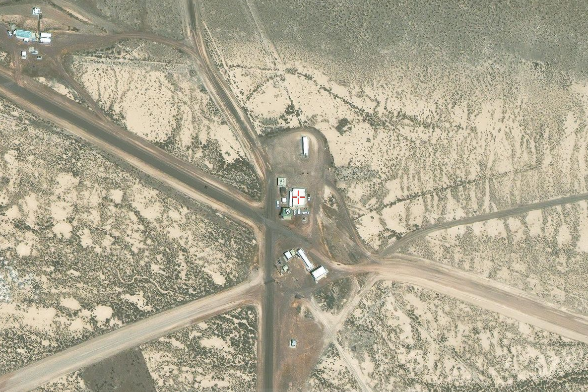

# Hacktoria - Intergalactic Warfare

# Hacktoria

Special Agent K. We have a serious matter on hand today. Klumgongyn has alerted us to the presence of an invasive alien species. Going by the name Krohndahkyr, these creatures are the stuff of nightmares. They lurk in the dark, staying motionless for days or stalking their prey using very heightened senses. Climbing, swimming and making vast leaps as they silently move through the dark.

The Krohndahkyr have the ability to regulate their temperature to the point they become invisible to thermal imaging. Using their many arms and spiked tentacles, they have the ability to rip a human to shreds in seconds.

Just a few hours ago, the Klumgon observed a scout ship of the 2nd Intergalactic Fleet of the Krohndahkyr, crash into earth near McKenzie National Park in Oregon. Shortly after impact, several helicopters arrived. US government personnel took away the wreckage and headed in southern direction. It was at this point that the Klumgon Intergalactic Cruiser, KSP Kerabella, lost sight of the helicopters.

So far any attempts at locating the helicopters has been futile. Making contact with the US government on this matter also brought us nowhere. All we got was laughed at over the phone and told to call a number for special individuals.

Regardless, we need to find the location of these aliens. If the Krohndahkyr manage to get a hold of any human, this will not end well. The Krohndahkyr will either rip them to pieces and disappear into the night and settle our planet. Or shoot their eggs into a human being. Inserted via direct penetration of the chest, the eggs hatch inside the corpse (or live human) within minutes. Eating their host as initial food source, before crawling away to grow into man sized Krohndahkyr in the next week.

Luckily for us, we have a few usual suspects for locations the US government might take alien remains. Mostly due to the fact that aliens always crash into US territory. Also, the Klumgon were able to intercept a broadcast coming from one of the Krohndahkyr’s devices. This indicates they are phoning home. Klumgongyn was able to reconstruct the image data, the encrypted text with coordinates remains unreachable for now. Use the image to locate the exact holding place of the Krohndahkyr so we can take further action.

In the meantime, Klumgongyn is coordinating with the KSP Kerabella, deploying several H-Wing Space-fighters towards our planet. They will keep an eye out for any Krohndahkyr spacecraft closing in. Let’s hope they don’t accidentally shoot down one of Elon’s toys this time. Last thing we need is that guy on our ass.

As always, Special Agent K. The contract is yours, if you choose to accept.

Construct the password using the coordinates of the red-cross on the map and the following format, small letters (sample):

country-state-county-161.2570-12.7212

(note, the amount of numbers in front of the dots might vary from the example depending on location).

# Clues

McKenzie National Park in Oregon

headed in southern direction

