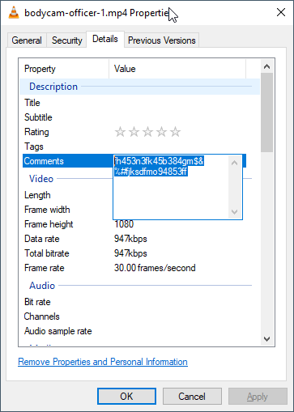
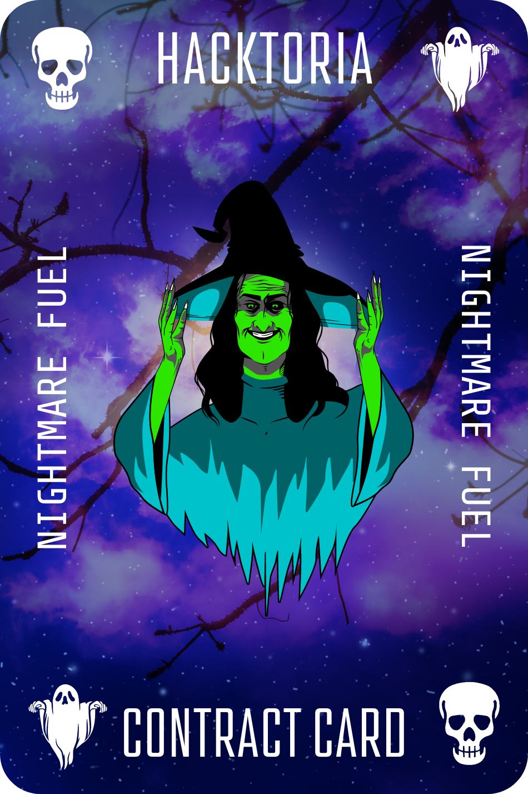

# Hacktoria - Nightmare Fuel

# Hacktoria

Greetings Special Agent K. Yesterday evening around 2100 hours, two officers of the New York Police Department entered the premise of an abandoned building in Brownsville New York. Neighbors had complained about strange sightings. Supposedly a woman had been squatting inside the building.

Reports also state that over the course of the two years the building has been abandoned, several residents of the surrounding houses had complained about junkies occupying the building. Often making terrible screeching like noises during the night.

Normally, this would not get the attention of the NYPD, however, a neighbors’ security camera had caught several people entering the building, but never seen them emerge. Upon closer inspection, a neighbor reported that all windows were closed and intact. Her security camera had also been on the whole time, surveying the only entrance to the building.

This eventually got the NYPD to investigate the building. While clearing rooms, the officers noticed someone moving around at the end of a hallway. Upon repeated calls and commands, the individual retreated behind a door. Both officers approached the door and told the person to come out. After a few seconds, we could see a woman move past the door frame.

Unresponsive to any commands given by the officers, they continued their search. Never to find the woman again. The officers called for backup and had a team of twelve officers and a K-9 unit sweep the building.

Nobody was ever found. Even the dog didn’t find a trail. Which is odd, given all the smells clearly lingering around an old building like that. Strangely enough, upon inspecting the body cam footage, the audio appeared to be missing entirely.

We need you to take a look at the video and see what you can find.

As always, Special Agent K, the contract is yours. If your choose to accept.

https://hacktoria.com/contracts/nightmare-fuel/

[Video](images/bodycam-officer-1.mp4)

---

# Metadata on the video

Text on comments: "fh453n3fk45b384gm$&%#fjksdfmo94853ff" tha is the password to open the contract file.

The link: https://bit.ly/3fYWbvM

