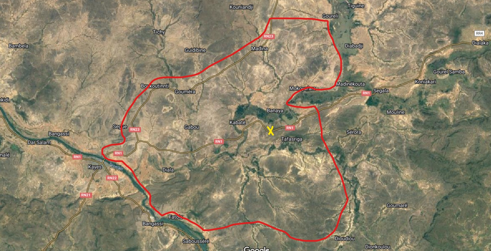

# Hacktoria - Prisoner of War

# Hacktoria

Greetings Special Agent K. We have an urgent contract for the government of France. After their official departure from Mali during August 2022, only a few platoons of Special Operation Units remain in the country. Officially, these troops are not present. Unofficially, they are there to protect high ranking politicians and other French partisans.

Two days ago, during a routine escort of a Malian VIP, the convoy was ambushed by unknown insurgent forces. The VIP and most of the convoy managed to return fire and make it out alive. One of the soldiers however, Raphaël Bernard, was hit in the right leg and taken prisoner by the insurgents.

Not being able to reach private Bernard before being captured, French forces were ordered to stand down and not give chase.

Continuing efforts of the French government to locate the missing private have yielded no results. Up until this morning, when a young girl approached a local police unit. She conveyed to them she had escaped a childrens home where she was kept against her will. The man who helped her escape, gave her a picture of the place they were being held. We have reason to believe this man is the missing private, Raphaël Bernard.

The girl approached the officers on the RN1 near “Posté de contrôle KAYES”. Below you find the image given to the girl, as well as the AOR (Area of Operation) of the remaining French detachement.

It’s your job to locate the building where the French private is being held. Once the location is confirmed, French special forces will conduct a raid to extract Raphaël Bernard.

As always, Special Agent K. The contract is yours, if you choose to accept.

https://hacktoria.com/contracts/prisoner-of-war/

Location of the ambush, marked with yellow: 14.495703,-11.156166,17

Construct the password for the linkfile using the full name of the location, as listed on Google Maps.

Example password: habitat-d-azure-hotel-champagne

Download the Linkfile

---

# Social Media search

