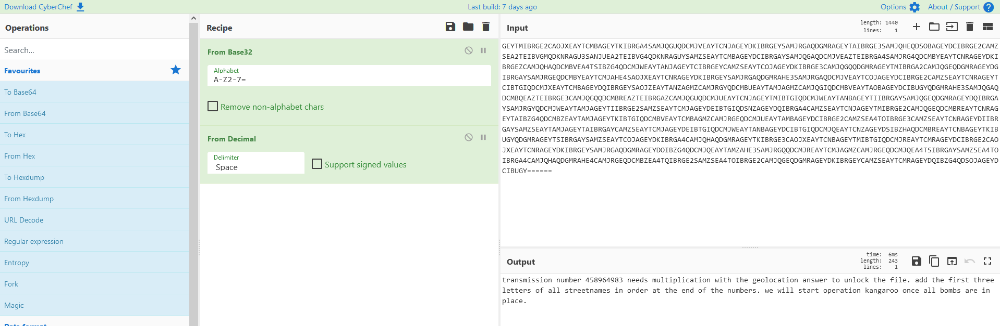
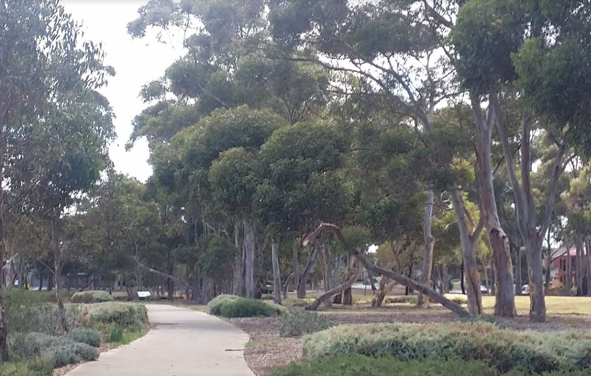
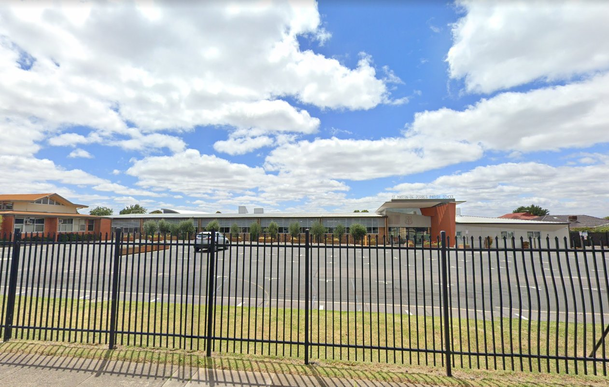
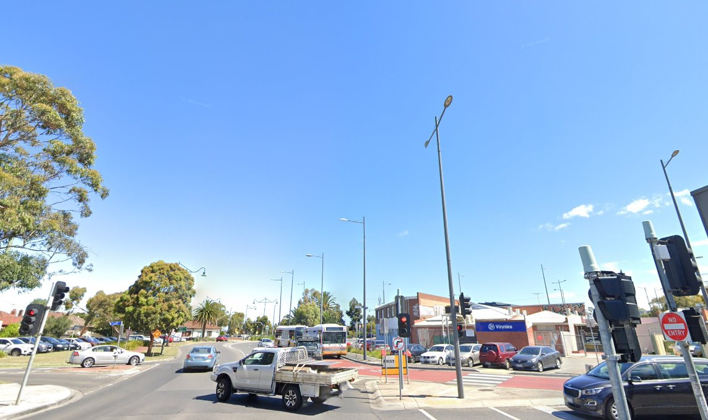
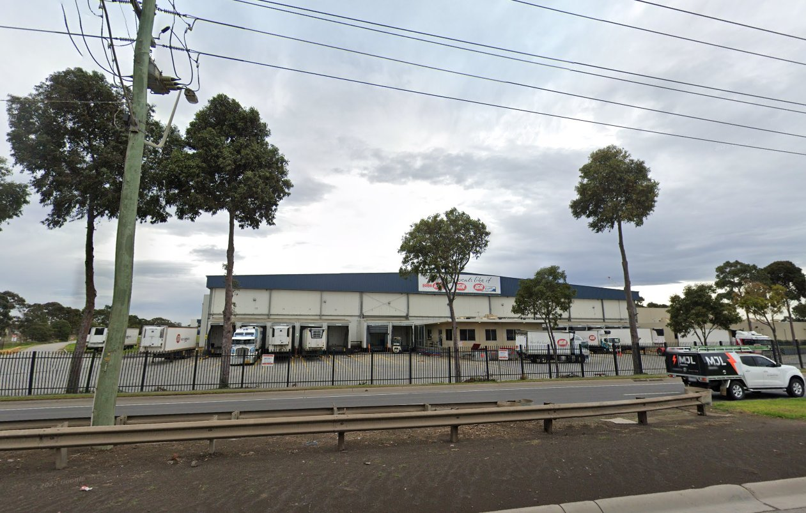
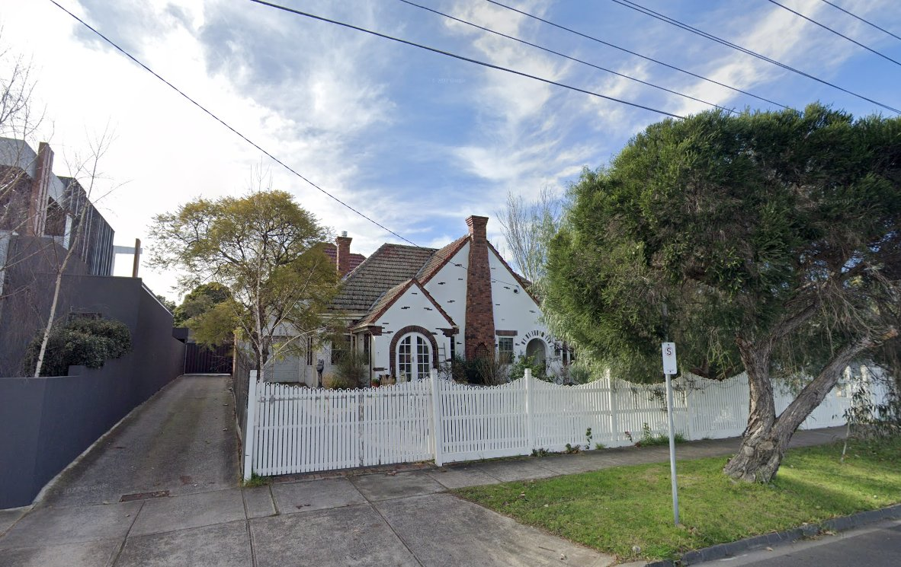
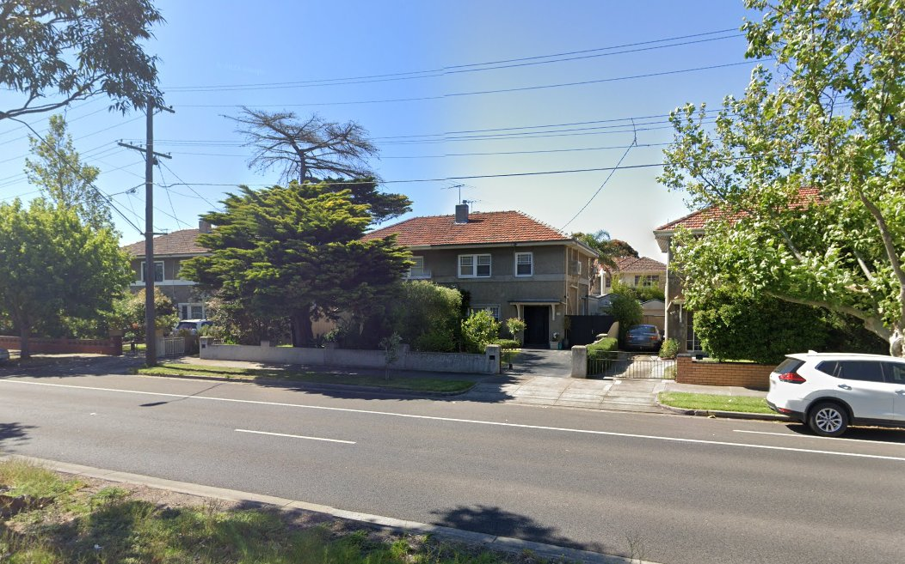
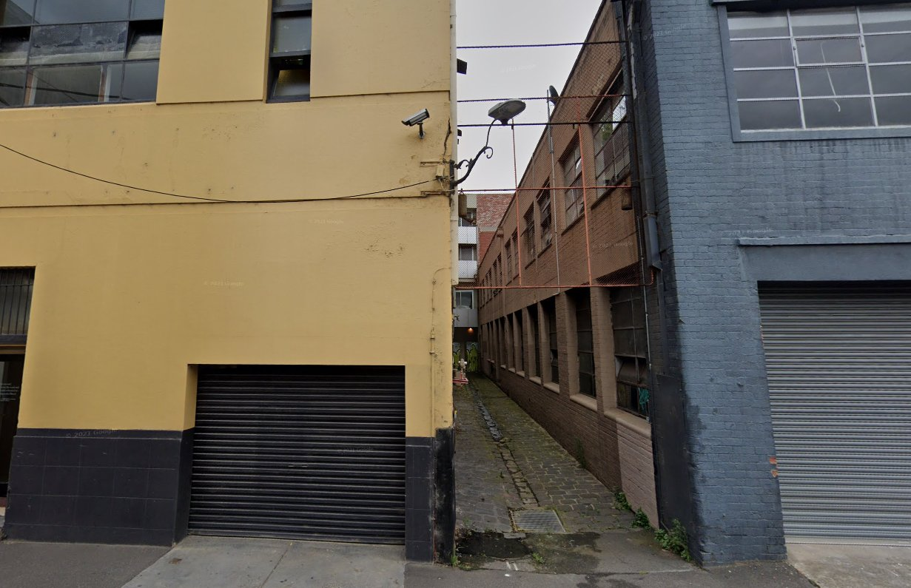

# Hacktoria - Lost Down Under

# Hacktoria

Greetings Special Agent K. We need your assistance in an urgent matter. Our client, the Australian Secret Intelligence Agency, ASIS for short, has requested our help to uncover a terrorist organization.

This group, who’s name is yet to be uncovered, has shown intent on bombing several locations around Australia. Their origins are confirmed to be domestic, with money coming in from Chinese non-government actors.

Several hours ago, one of our Red Teams was able to breach one of the terrorist groups’ email accounts. There was a single email, containing a cryptic looking text and a total of seven images.

We need you to figure out what these seven images and text mean. Are they connected? Is this a rabbit hole? With our current information, we have reason to believe these images are directly related to the suspected plans for bombings.

The answer from the text and images leads to the password for unlocking the linkfile. Which contains the link to your contract card.

As always. Special Agent K, the contract is yours, if you choose to accept.

---

Given text

GEYTMIBRGE2CAOJXEAYTCMBAGEYTKIBRGA4SAMJQGUQDCMJVEAYTCNJAGEYDKIBRGEYSAMJRGAQDGMRAGEYTAIBRGE3SAMJQHEQDSOBAGEYDCIBRGE2CAMZSEA2TEIBVGMQDKNRAGU3SANJUEA2TEIBVG4QDKNRAGUYSAMZSEAYTCMBAGEYDCIBRGAYSAMJQGAQDCMJVEAZTEIBRGA4SAMJRG4QDCMBYEAYTCNRAGEYDKIBRGEZCAMJQHAQDCMBVEA4TSIBZG4QDCMJWEAYTANJAGEYTCIBRGEYCAMZSEAYTCOJAGEYDKIBRGE3CAMJQGQQDGMRAGEYTMIBRGA2CAMJQGEQDGMRAGEYDGIBRGAYSAMJRGEQDCMBYEAYTCMJAHE4SAOJXEAYTCNRAGEYDKIBRGEYSAMJRGAQDGMRAHE3SAMJRGAQDCMJVEAYTCOJAGEYDCIBRGE2CAMZSEAYTCNRAGEYTCIBTGIQDCMJXEAYTCMBAGEYDQIBRGEYSAOJZEAYTANZAGMZCAMJRGYQDCMBUEAYTAMJAGMZCAMJQGIQDCMBVEAYTAOBAGEYDCIBUGYQDGMRAHE3SAMJQGAQDCMBQEAZTEIBRGE3CAMJQGQQDCMBREAZTEIBRGAZCAMJQGUQDCMJUEAYTCNJAGEYTMIBTGIQDCMJWEAYTANBAGEYTIIBRGAYSAMJQGEQDGMRAGEYDQIBRGAYSAMJRGYQDCMJWEAYTAMJAGEYTIIBRGE2SAMZSEAYTCMJAGEYDEIBTGIQDSNZAGEYDQIBRGA4CAMZSEAYTCNJAGEYTMIBRGE2CAMJQGEQDCMBREAYTCNRAGEYTAIBZG4QDCMBZEAYTAMJAGEYTKIBTGIQDCMBVEAYTCMBAGMZCAMJRGEQDCMJUEAYTAMBAGEYDCIBRGE2CAMZSEA4TOIBRGE3CAMZSEAYTCNRAGEYDIIBRGAYSAMZSEAYTAMJAGEYTAIBRGAYCAMZSEAYTCMJAGEYDEIBTGIQDCMJWEAYTANBAGEYDCIBTGIQDCMJQEAYTCNZAGEYDSIBZHAQDCMBREAYTCNBAGEYTKIBUGYQDGMRAGEYTSIBRGAYSAMZSEAYTCOJAGEYDKIBRGA4CAMJQHAQDGMRAGEYTKIBRGE3CAOJXEAYTCNBAGEYTMIBTGIQDCMJREAYTCMRAGEYDCIBRGE2CAOJXEAYTCNRAGEYDKIBRGEYSAMJRGAQDGMRAGEYDOIBZG4QDCMJQEAYTAMZAHE3SAMJRGQQDCMJREAYTCMJAGMZCAMJRGEQDCMJQEA4TSIBRGAYSAMZSEA4TOIBRGA4CAMJQHAQDGMRAHE4CAMJRGEQDCMBZEA4TQIBRGE2SAMZSEA4TOIBRGE2CAMJQGEQDGMRAGEYDKIBRGEYCAMZSEAYTCMRAGEYDQIBZG4QDSOJAGEYDCIBUGY======

---

Decoded by

Into the following text:

transmission number 458964983 needs multiplication with the geolocation answer to unlock the file. add the first three letters of all streetnames in order at the end of the numbers. we will start operation kangaroo once all bombs are in place.

---

## Thoughts

Images have several power lines.

---

## Image 01

---

## Image 02

https://goo.gl/maps/ytz15uuXur72A36U8

St Martin de Porres Parish School
158 Military Rd, Avondale Heights VIC 3034, Victoria, Australia
171 State Road

---

## Image 03

Tried looking at all the Vinnies in Melbourne/Victoria.

---

## Image 04

"How the locals like it"
IGA
supermarket

Tried looking for IGA central deposits

---

## Image 05

---

## Image 06

---

## Image 07

