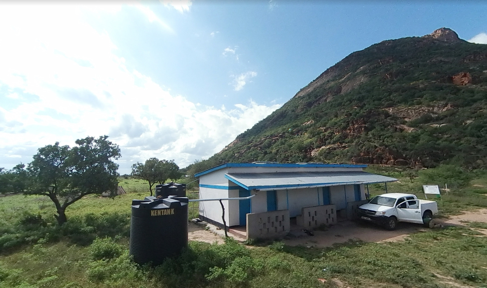
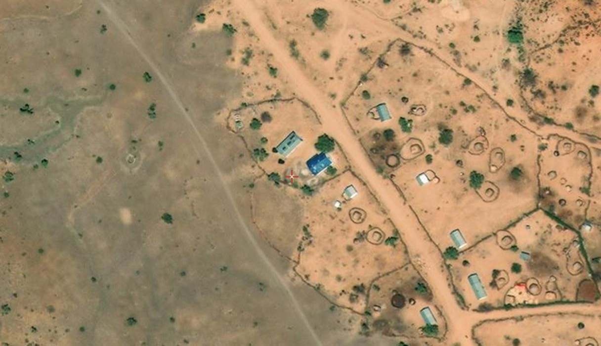

# Hacktoria - Far Away Outpost

# Hacktoria

Greetings Special Agent K. I hope you’re in the mood for hunting down some poachers. We have a contract from the Kenyan government to track down an animal smuggling and poaching operation.

This group uses various humanitarian organizations as fronts for their poaching operations. Often pretending to be building civilian infrastructure to obscure their activities.

In their latest attempts to stay undetected, the group started to present themselves as construction workers. Traveling to remote villages and outposts to supposedly install water tanks and wells. Unsuspecting locals would let them go about their business, as they used this cover to poach wild animals.

Last week, the Kenyan authorities were able to apprehend one of their members. They were able to extract a few pieces of information from his cellphone. Unfortunately, the young man hung himself that same night. Making further questioning somewhat troublesome.

You’ll find the information we have below. Your mission is simple, find the location of the current poacher outpost.

As always. Special Agent K, the contract is yours, if you choose to accept.

Put together the password as, all lowercase letters:

country-county-road-nearest-t-split-road

Example (leave out words like road/rd : france-champagne-nicelane-splitlane

https://hacktoria.com/contracts/far-away-outpost/

# 

