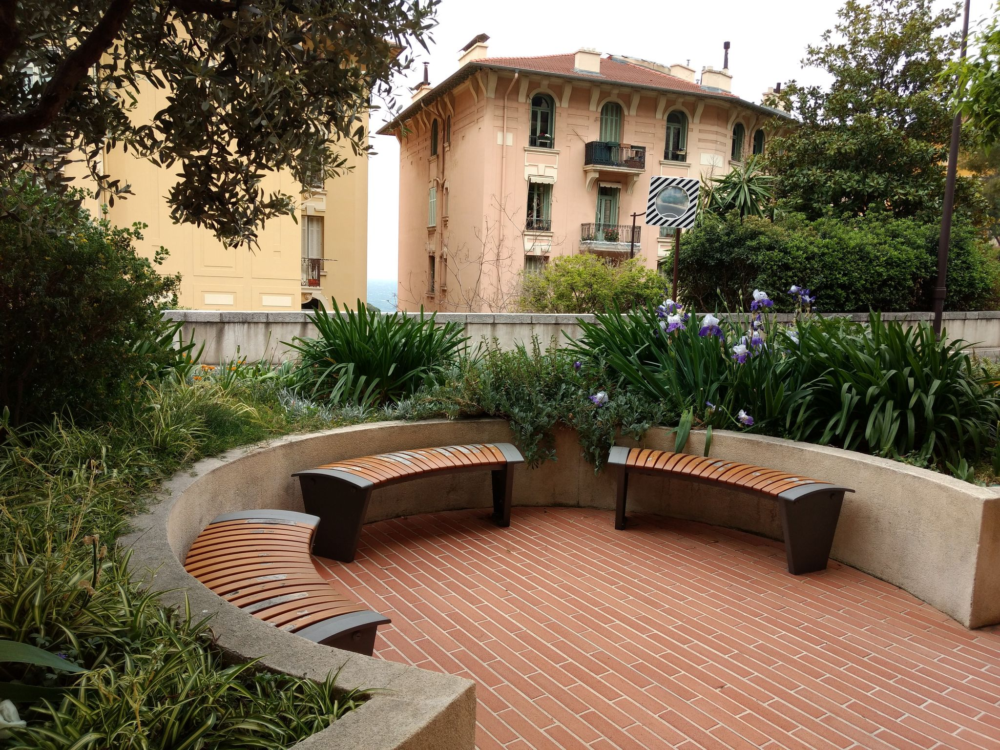
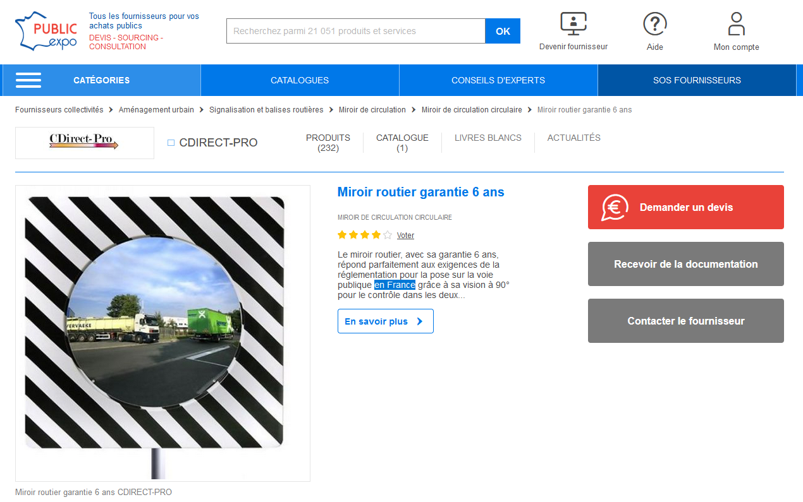
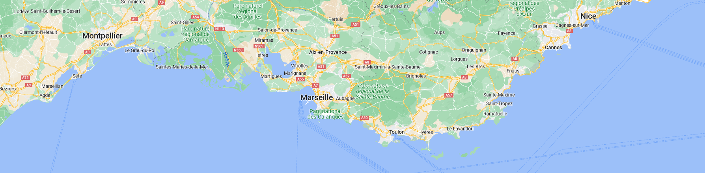
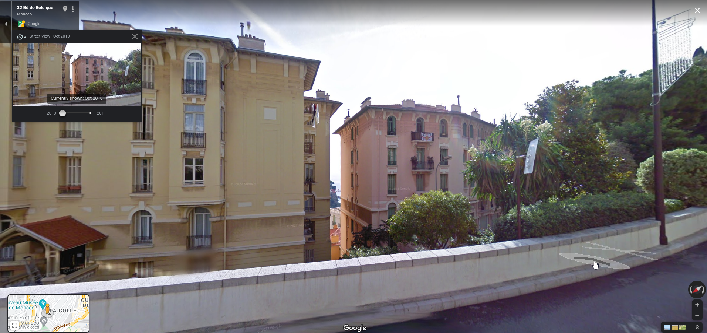
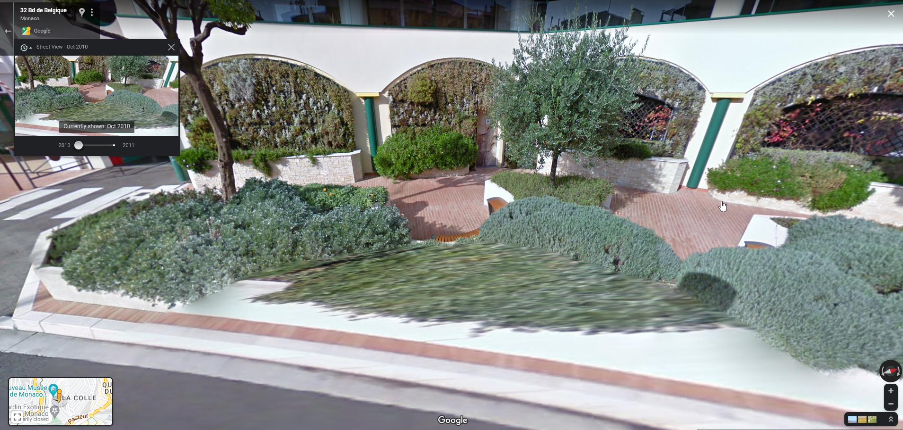
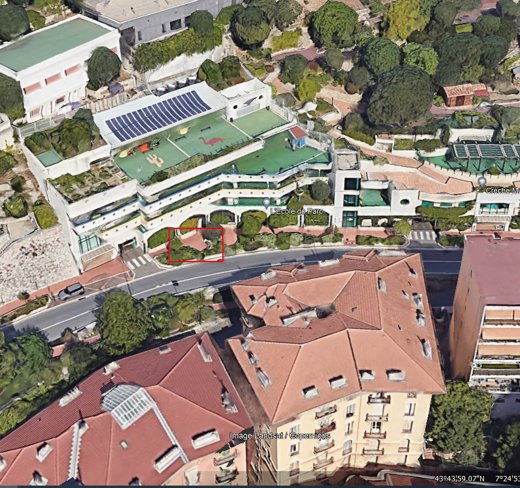
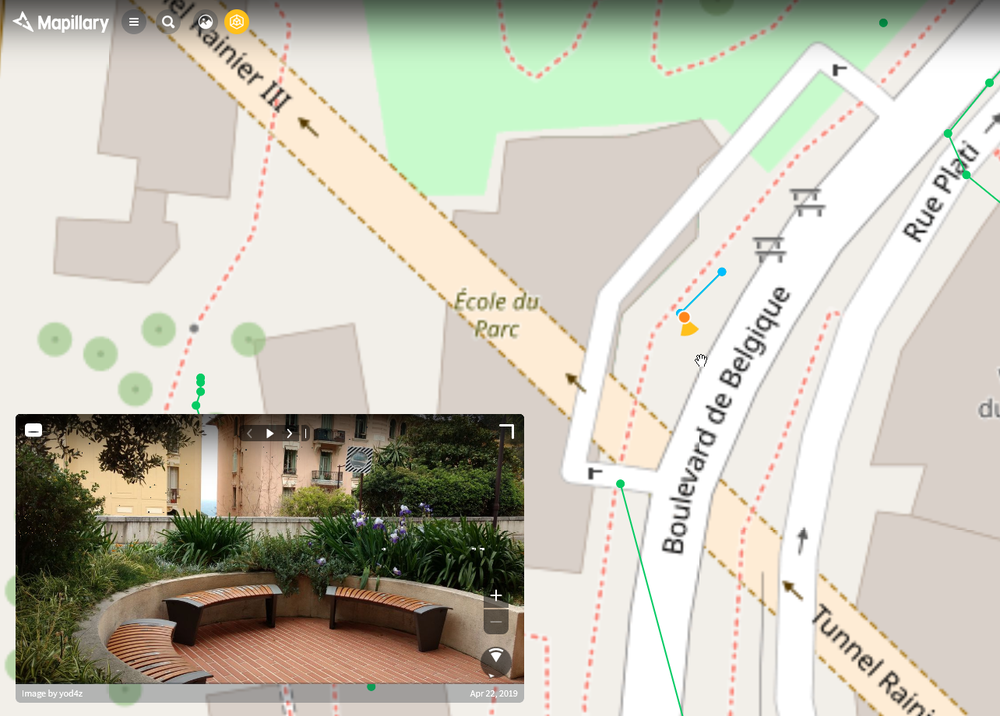
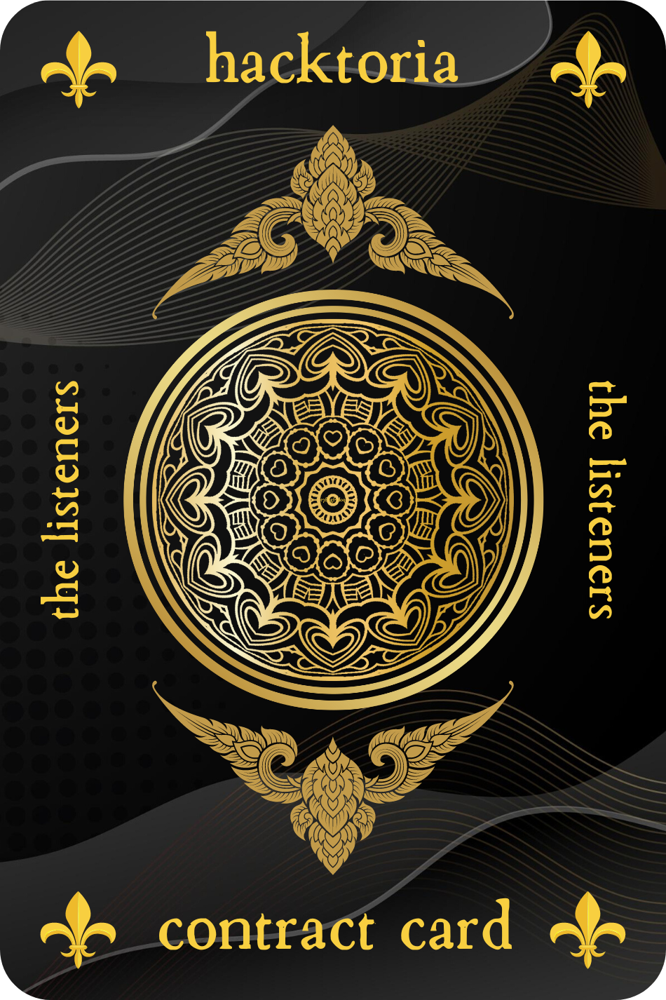

# Hacktoria - The Listeners

# Hacktoria

Good day Special Agent K, glad you could make it. One of our oldest clients, a wealthy French businessman, is requesting we find a location where a conversation between two of his rivals will take place. These two have been after our clients’ fortune for a long time, endlessly scheming to end his business endeavors. After their recent attempt to sink one of our clients’ boats off the coast of Spain, while his wife and daughter were on board, our client has had enough.

The plan is to uncover the location of their meeting and have one of our Field Agents plant a listening device. This will record the meeting and lead to the valuable information our client is looking for. Using this information our client plans to take down the businesses of both rivals.

After their businesses are destroyed, we will be called upon again to fully end their existence. Something that, given the high profile of these men, wil make Hacktoria a hefty amount of money. As well as some very good standing with the French elite.

There is a catch to this however. We don’t know where this meeting will take place. Our client was able to intercept an image of the meeting location, which will take place 3 days from now at noon. Besides this photo, we know these rivals share a common interest in luxurious lifestyles along the coastlines of Western and Southern Europe.

Using this information and the intercepted image below, it is your task to figure out exactly where this meeting will take place. Our Field Agent closest to this region will take over from there.

Use your findings to generate the password that will unlock the “linkfile”, which in turn leads to your Contract Card.

The pattern will be as follows (make sure to add a dash between every word).:

country-zipcode-fullstreet-name-number

As always. Special Agent K, the contract is yours, if you choose to accept.

https://hacktoria.com/contracts/the-listeners/

# 

Put image on Bing Images and focus on the traffice mirror.

The first result <https://www.public-expo.fr/miroir-routier-p258829443.html>

And on the text says that it complies with the demands of the regulation for public streets.

So the country is France.

"luxurious lifestyles along the coastlines of Western and Southern Europe":

On the picture, between the buildings we can see the sea.

Saint-Tropez? Cannes? Monaco ?

L'Ecole du Parc
32 Bd de Belgique
98000 Monaco 

Monaco-98000-Boulevard-de-Belgique-32

https://bit.ly/3qxVdsj

