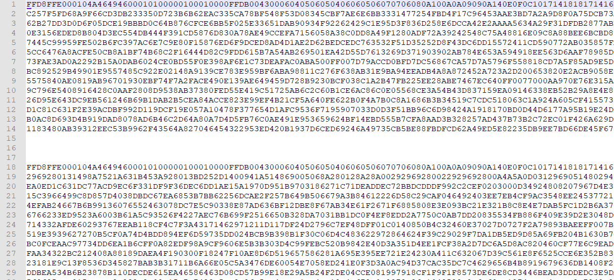
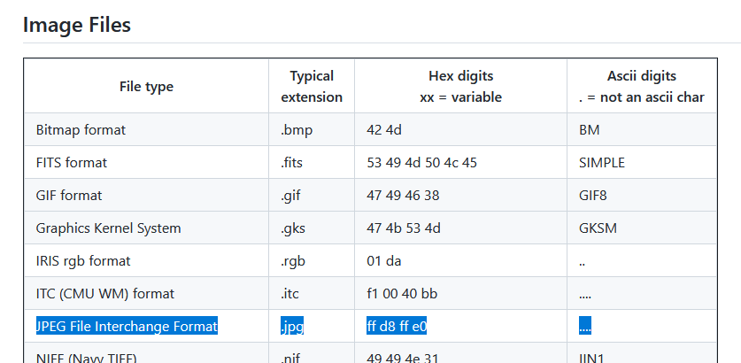
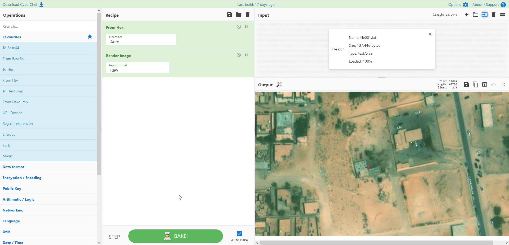
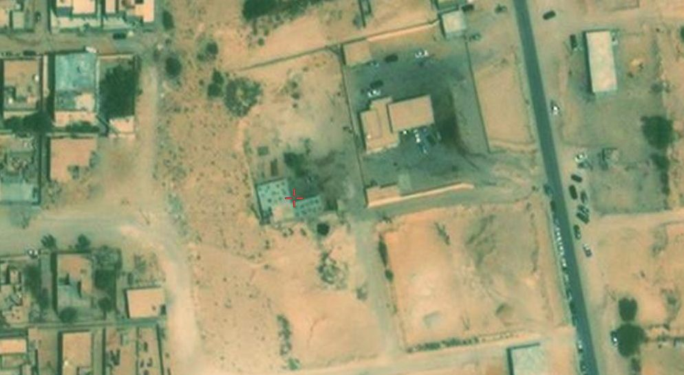
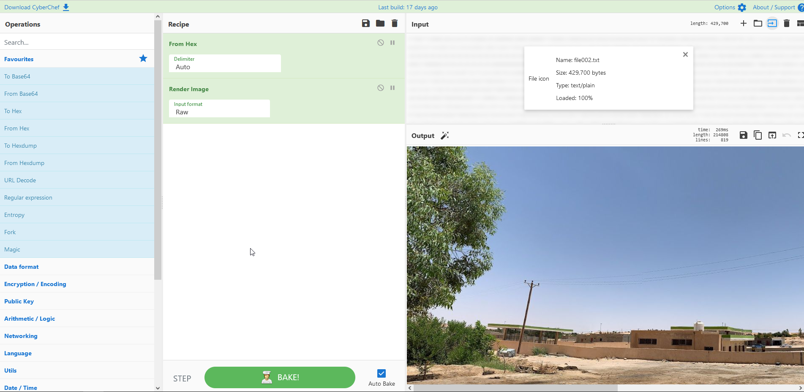
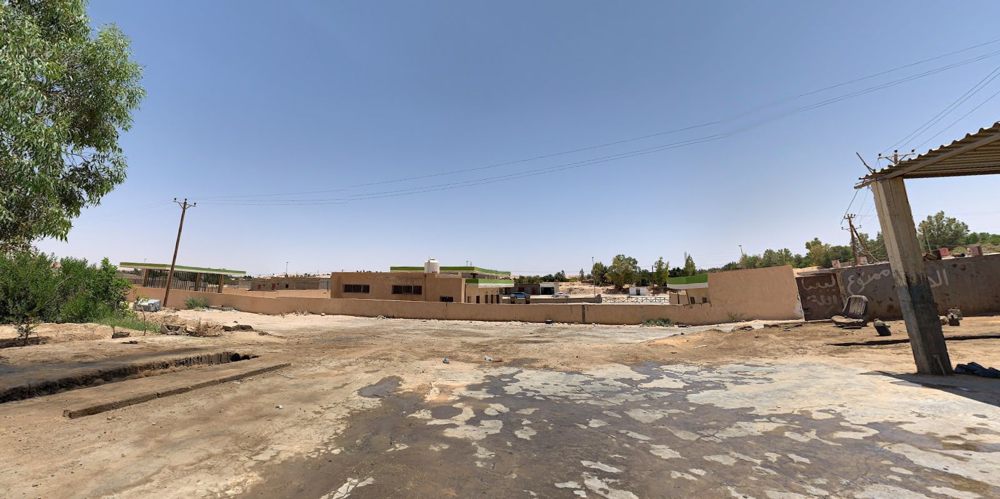

# Hacktoria - A Strange File

# Hacktoria

Greetings Special Agent K. During a raid of our allies in the country of Oman, several computers and server equipment were confiscated.

The authorities of Oman spent the past week analyzing the data that resides on this hardware. However, they were not able to make sense of all the data.

This is where we come in. The Overseer of Hacktoria has agreed to a no-cure no-pay assignment for the government of Oman. If we manage to figure out what the file they’ve sent us means, we take on several additional contracts in the future, at very favorable terms.

A little more information about this file. It was found in a folder named “meeting location”. It had several text files in it, that all had written details about locations and people.

There was one file however, that the Oman authorities were not able to convert to text. This is the file you find below. Please make sense of it and report your findings Special Agent.

As always, Special Agent K. The contract is yours, if you choose to accept.

For this contract you will need to use the website https://what3words.com/

The password to open the linkfile consists of (lowercase letters):

country-district-city-areadialcode-what-three-words-business-type

Sample password:

italy-veneto-verona-045-hot-pasta-sauce-paper-mill

https://hacktoria.com/contracts/a-strange-file/

# Analyze file

Looking at the file it is hex and starts with "FFD8FF" and is split inside. 2 files ?

# Magic Bytes

---

# Using cyberchef to transform the first text to image

---

# Using cyberchef to transform the second text to image

# Clues

Gas station

From both images seems that we are standing in a car repair garage (parts laying arround) and looking at the back of a petrol/gas station.

Maybe not Oman as country?

The words translated to "Elsa", "Prohibited" and "The" using Google Lens.