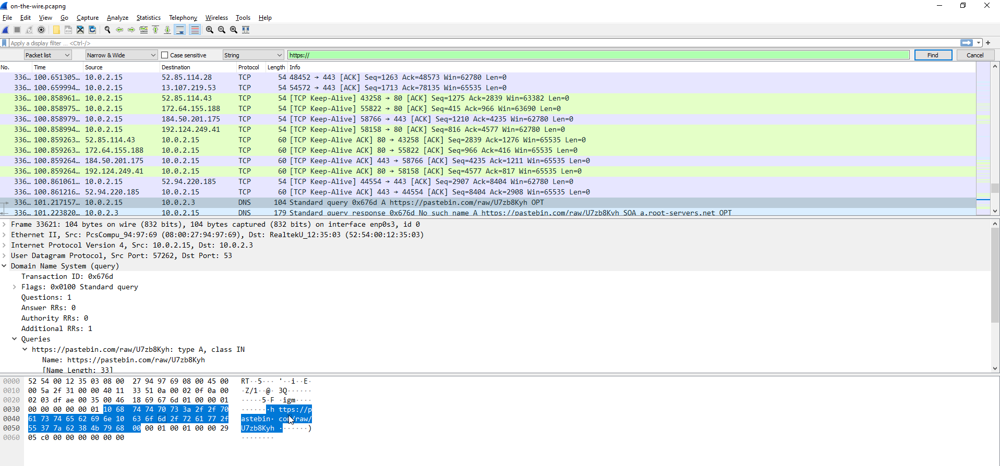
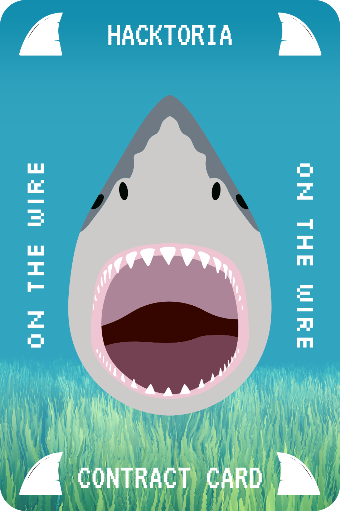

# Hacktoria - On the Wire

# Hacktoria

Greetings Special Agent K. One of our field agents in Malaysia managed to physically breach the office of a corrupt politician. Doubling as a mole for a Chinese criminal enterprise, mostly smuggling endangered animals. In this case their evil business involves shark fin trade and other exotic food items.

During the breach, our agent successfully obtained several pieces of information on the organization. Currently this does not include their name, as they only communicate using anonymous messages and codenames.

We hope that the information, which includes pictures, floorplans, data dumps and packet captures. Will lead to a more complete picture of this organization. We know that the Malaysian government will be exceptionally happy to get this criminal enterprise out of its borders.

All data has been divided over several agents. Your segment for this contract is the analysis of a packet capture file. Figure out what is being communicated and find the message that matters. This message will lead to your Contract Card.

As always. Special Agent K, the contract is yours, if you choose to accept.

https://hacktoria.com/contracts/on-the-wire/

---

Used wireshark to open the pcap file. Searched for string http.

https://pastebin.com/raw/U7zb8Kyh

---

https://bit.ly/3qyrf7t

