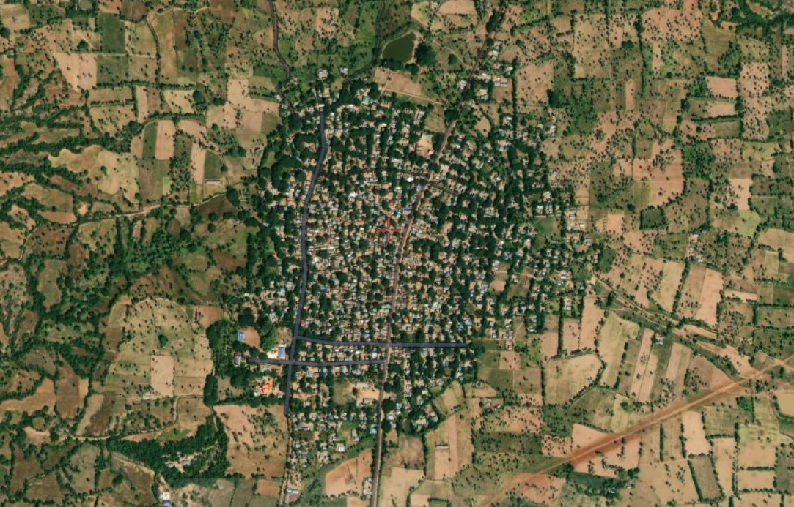
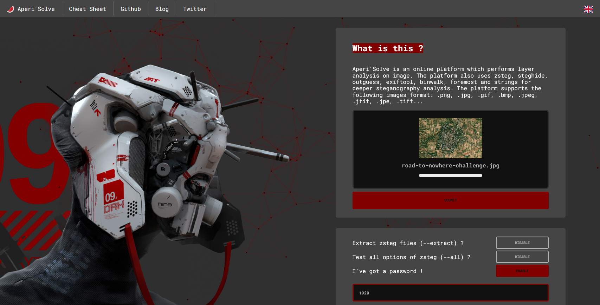
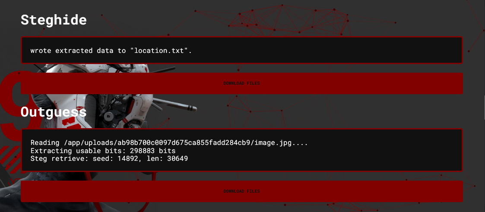
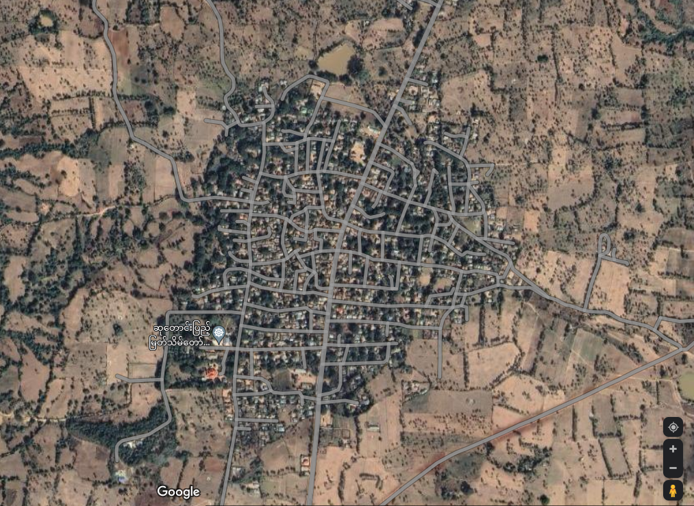
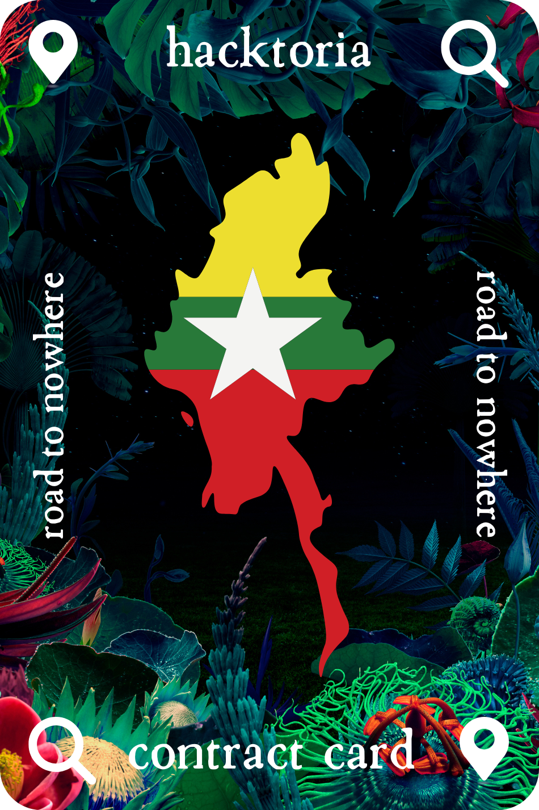

# Hacktoria - Road to Nowhere

# Hacktoria

Special Agent K, we’ll be needing your assistance on a geolocation matter. One of our clients, a medium sized European goverment agency, has requested we find a needle in a haystack.

Our client is involved in fighting terrorist groups in Asia and Africa. Recently, they gained access to a Dropbox account filled with map data. Most of these seem to be related to safe houses used by a terrorist organization called “The Meercats”. Indeed a strange name, but nontheless, they mean business.

After having located most safehouses, our client is still struggling to locate a few of them. Since the operation to take down all of these locations needs to be synchronized. There’s an urgent need to identify them all before the next phase can begin.

Below you find an image of what appears to be a village, with a red marker to indicate the exact location. It’s your assignment to find where in the world this is. Currently we have reason to believe this is in Africa or Asia. But, given the organizations’ widespread members, this is only a guess at this time.

Use the coordinates you find as the password to open the ZIP archive. Inside, you find the linkfile to your Contract Card as always. Also, we heard the number 1920 is of importance in this case…

As always. Special Agent K, the contract is yours, if you choose to accept.

https://hacktoria.com/contracts/road-to-nowhere/

---

Tried to look for this region in Namibia / South Africa because of the clues "The Meercats" - Meerkat <https://en.wikipedia.org/wiki/Meerkat> with no luck.

---

Tried <https://www.aperisolve.com/> with password option enabled and password "1920"

The result show a file "location.txt" hidden inside the picture.

---

The content of the file is:

20.899370,95.118041,16

which seem to be coordinates 20.899370,95.118041

on [Google Maps](https://www.google.com/maps/place/20%C2%B053'57.7%22N+95%C2%B007'05.0%22E/@20.899375,95.1158523,973m/data=!3m2!1e3!4b1!4m2!3m1!1s0x0:0x65daa2984911019)

Shows that this location is: Hnit Kyat Khwe, Myanmar (Burma)

---

Using "20.899370,95.118041,16" as password to unzip the file.

Content of unziped file: https://bit.ly/3eMaV0v

