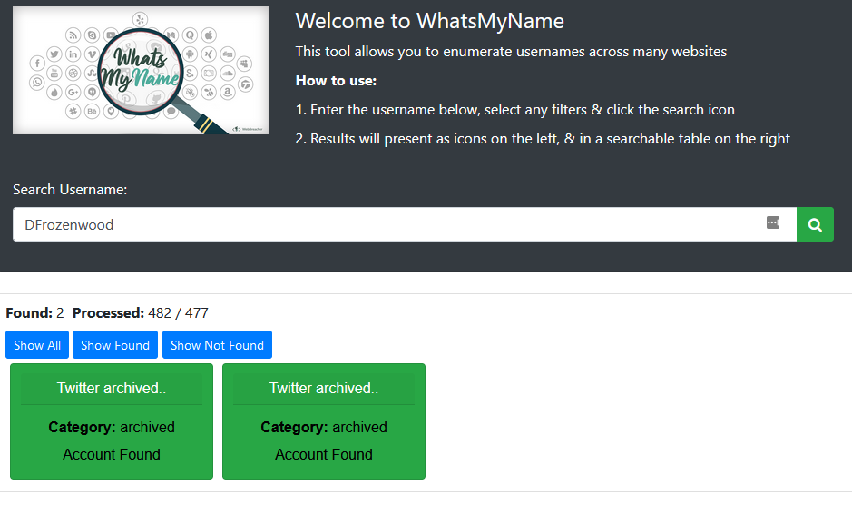
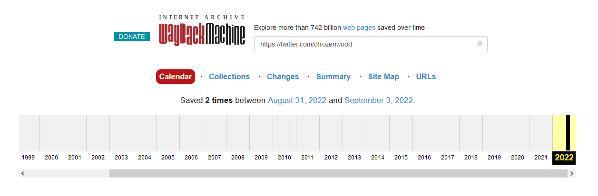
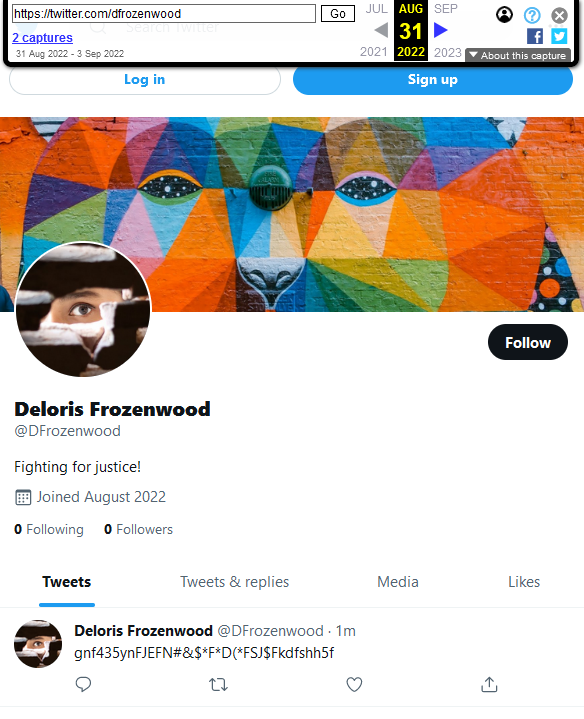
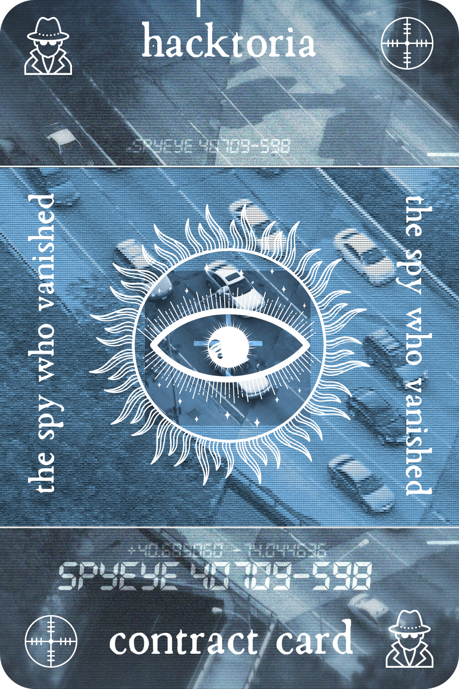

# Hacktoria - The Spy who Vanished

# Hacktoria

Greetings, Special Agent K. We have received information regarding the long lost spy from MI5, Deloris Frozenwood. She went missing in action a few years ago, never to be seen again. From what we understand, she went on to provide services to whoever the highest bidder might be.

Before she went rogue, Deloris was a revered operative within MI5. Taking on some of the most dangerous assignments and quickly working her way through the ranks. Discontent with management, she took matters into her own hands. Often skirting the lines between rule of law and criminal behavior. She was eventually terminated from MI5.

What happened after her career at MI5 remains shrouded in mystery. She showed up on the radar several times, but only for very brief moments. Having become a target of the organization she once worked for, she’s even gotten arrogant. Often making deliberate appearances for a brief moment, before vanishing to the shadows once again.

Our colleagues at MI5 have asked us to obtain any information on Deloris Frozenwood we can find. They’re particularly interested in social media profiles. For reference, Deloris often appears as “Deloris Frozenwood”, or as “D Frozenwood”.

If you find Deloris, her presence will lead you to the password to unlock your linkfile, containing the link to your contract card for this contract.

As always. Special Agent K, the contract is yours, if you choose to accept.

https://hacktoria.com/contracts/the-spy-who-vanished/

---

# Social Media search

https://whatsmyname.app/

For result on "DFrozenwood"

---

Result sends to archive twitter account. WaybackMachine site shows 2 captures.

---

One of the captures shows the archived twitter page.

---

On one post there is a text string: "gnf435ynFJEFN#&$*F*D(*FSJ$Fkdfshh5f"

Unzip the file with that text as password

https://bit.ly/3eJUly7

